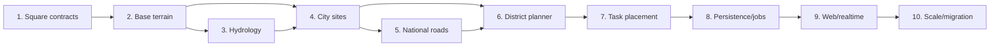

# Square World Generation V3 — декомпозиция

## Стратегия поставки

Поставлять вертикальными срезами поверх нового `generatorVersion = square-v3`. Старый hex-режим не расширять; он остаётся только для сравнения до готовности миграции.

### Срез 1. Квадратные координаты и контракт чанка

**Зависимости:** нет.  
**Результат:** `Cell{x,y}`, `ChunkCoord{x,y}`, `Rect`, 4-битная маска соединений, корректные отрицательные координаты, версия генератора в DTO.  
**Проверка:** unit/property-тесты `world→chunk→local→world`, границы и отрицательные значения.

### Срез 2. Детерминированная базовая местность

**Зависимости:** 1.  
**Результат:** высота, влажность, температура, domain warp, материалы и переходы; чанк 64×64 генерируется независимо от порядка запросов.  
**Проверка:** snapshots фиксированных сидов, seam-тесты соседних чанков, бюджет времени.

### Срез 3. Макрогидрология и природные объекты

**Зависимости:** 2.  
**Результат:** макрорегионы, граничные порты, русла, озёра, берега, лесные кластеры и поля декора.  
**Проверка:** отсутствие обрывов на границах, связность русел, формы озёр без одноклеточного шума.

### Срез 4. Площадки городов и территории роста

**Зависимости:** 2–3.  
**Результат:** Poisson-disc кандидаты, оценка пригодности, начальный envelope 100×100, growth reserve, городские ворота.  
**Проверка:** 10 городов на 100 сидах, расстояния, отсутствие критического наложения на воду и чужие резервы.

### Срез 5. Национальная дорожная сеть

**Зависимости:** 4.  
**Результат:** Delaunay/k-nearest кандидаты, MST для связности, дополнительные рёбра для петель, двухуровневый A*, T-перекрёстки, мосты.  
**Проверка:** все города достижимы, маски соединений взаимны, мосты проходят bank-to-bank.

### Срез 6. Планировщик района

**Зависимости:** 4–5.  
**Результат:** дорожный каркас, constrained polyomino, скрытые участки, public-space slots, ростовой сектор и state machine.  
**Проверка:** сравнение алгоритмов, отсутствие дыр/тонких хвостов, два активных района не конфликтуют.

### Срез 7. Планировщик задач и каталог зданий

**Зависимости:** 6 и манифест спрайтов.  
**Результат:** классы участков, rotations, семантические теги, top-K scoring, фиксация выбора, отображение пяти стадий.  
**Проверка:** все footprints каталога, коллизии, доступ, разнообразие, явная ошибка при невозможности.

### Срез 8. Персистентность, задания и события

**Зависимости:** 1–7.  
**Результат:** generation jobs, revisions, транзакционные блокировки, outbox, идемпотентные команды, чанковые snapshot/delta endpoints.  
**Проверка:** повтор команды, конкурентное добавление задач, восстановление worker после сбоя.

### Срез 9. Web-рендер и WebSocket

**Зависимости:** 2, 5–8.  
**Результат:** viewport culling, prefetch ring, sprite atlas, district overlays, chunk invalidation/delta, модалка здания.  
**Проверка:** 10-городской сценарий, pan/zoom, reconnect, отсутствие полной перезагрузки мира.

### Срез 10. Доказательство масштаба и миграция

**Зависимости:** все предыдущие.  
**Результат:** 1 000-seed property suite, нагрузочный профиль, очистка hex-кода, эксплуатационная документация и server presets.  
**Проверка:** все критерии overview, restore/backup, Docker deployment smoke.

## Граф зависимостей

