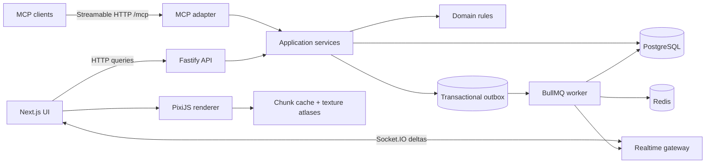

# Архитектура

> **Geometry update 2026-08-02:** разделы с axial hex/polyhex отражают старый прототип. Целевой worldgen, contracts и data ownership описаны в `../square-world-generation-v3/architecture.md`.

## Current boundary

Рабочий MVP — один TypeScript-проект: React/Vite UI, PixiJS renderer, Fastify API/MCP/Socket.IO gateway и SQLite application state. Все мутации проходят через `AppService`, внешний интерфейс проектов/спринтов/задач остаётся read-only. Старый статический proof-of-concept сохранён в `archive/static-prototype` и не входит в сборку.

## Target boundary после подтверждения MVP



### Рекомендуемый стек

- Monorepo: `pnpm` workspaces + Turborepo.
- Язык: TypeScript в UI, API, worker, MCP и worldgen.
- Web: Next.js + React; DOM отвечает за навигацию, модалки, формы авторизации и accessibility.
- Map renderer: PixiJS v8; карта не должна строиться из React-компонентов на каждый гекс.
- API: Fastify; JSON Schema/Zod на каждой внешней границе.
- Realtime: Socket.IO rooms `country:{id}`, `project:{id}`, `task:{id}`.
- DB: PostgreSQL + Drizzle ORM.
- Jobs/cache: Redis + BullMQ.
- Auth: Better Auth с email/password и обязательной email verification перед выпуском production-токенов.
- MCP token MVP: Better Auth API Key plugin, ключи с prefix, scope, expiry, rate-limit и хранением только hash.
- MCP transport: официальный Streamable HTTP endpoint `/mcp`; WebSocket не является MCP-транспортом.
- Files: локальное хранилище в dev, S3-совместимое в production для asset packs и preview.
- Local runtime: Docker Compose для Postgres/Redis/MinIO/Mailpit.

Версии библиотек фиксируются lockfile в момент начала реализации; перед копированием API SDK нужно сверяться с актуальной официальной документацией.

## Структура monorepo

```text
apps/
  web/              Next.js UI + task modal + integrations
  api/              HTTP API + auth + Socket.IO gateway
  worker/           worldgen, placement, outbox delivery
packages/
  domain/           entities, invariants, state machines
  application/      commands, queries, transactions
  contracts/        Zod schemas, event envelopes, DTO
  worldgen/         axial hex, chunks, terrain, roads, districts
  renderer/         PixiJS camera, layers, hit testing, culling
  asset-pipeline/   atlases, validators, contact sheets
  building-catalog/ versioned catalog and footprint templates
  mcp/              tool/resource registration over application services
infra/
  docker/
  migrations/
```

## Главные границы ответственности

### Domain

Не знает о HTTP, MCP, PixiJS или Socket.IO. Содержит:

- состояния проекта, спринта и задачи;
- допустимые переходы;
- расчёт capacity SP;
- правила footprint и занятости гексов;
- уникальность страны пользователя;
- правила одной активной итерации на проект;
- события домена.

### Application

Единственная точка мутаций. Каждая команда:

1. проверяет identity/scope;
2. проверяет `idempotencyKey`;
3. загружает агрегаты;
4. применяет domain command;
5. сохраняет состояние и outbox-события одной транзакцией;
6. возвращает DTO и `worldVersion`.

API и MCP никогда не дублируют бизнес-логику.

### Worldgen

Чистые детерминированные функции, зависящие только от:

- `countrySeed`;
- `generatorVersion`;
- координат чанка;
- сохранённых overlay mutations.

### Renderer

Получает готовые `ChunkDTO` и события. Не решает, где должен находиться город или здание. Может предсказывать только визуальную анимацию, но сервер остаётся источником истины.

## Авторизация и страна

1. Регистрация создаёт user/session.
2. После успешной регистрации application command `country.ensureForUser` выполняется с уникальным индексом `countries.owner_user_id`.
3. Если две вкладки вызывают команду одновременно, одна вставка выигрывает, вторая читает существующую страну.
4. Страна получает криптографически случайный seed и `generatorVersion`.
5. Сервер отдаёт bootstrap DTO: country, camera, known projects, visible chunk descriptors, current world version.

Для MVP у пользователя одна страна. Модель должна позволять позже добавить membership и несколько стран без изменения сущностей проекта.

## Realtime protocol

### Не отправлять мир целиком по WebSocket

- HTTP: bootstrap, сущности, chunk payload, история комментариев.
- WebSocket: небольшие события/дельты и invalidation координат чанков.

### Event envelope

```ts
type RealtimeEvent<T> = {
  eventId: string;
  countryId: string;
  aggregateType: "country" | "project" | "sprint" | "task" | "chunk";
  aggregateId: string;
  type: string;
  version: number;
  occurredAt: string;
  payload: T;
};
```

### Основные события

- `country.created`
- `project.created`
- `city.allocated`
- `road.network_changed`
- `sprint.created`
- `sprint.activated`
- `district.allocated`
- `task.created`
- `building.assigned`
- `task.status_changed`
- `task.progress_reported`
- `task.comment_added`
- `building.stage_changed`
- `chunk.invalidated`

### Восстановление соединения

- клиент хранит последний `worldVersion` и event cursor;
- Socket.IO recovery используется как оптимизация, а не гарантия;
- если `socket.recovered === false` или обнаружен разрыв версий, клиент вызывает `GET /countries/current/snapshot?sinceVersion=N`;
- после snapshot клиент повторно запрашивает только затронутые чанки.

## Слои PixiJS

Порядок снизу вверх:

1. terrain chunks;
2. shoreline/water transitions;
3. road and bridge overlays;
4. district/city perimeter;
5. foundation decals;
6. buildings, отсортированные по screen baseline;
7. construction FX;
8. selection/highlight;
9. lightweight world labels.

Модалки, сайдбар и доступные элементы управления остаются в DOM поверх canvas.

## Модель данных

### Auth/ownership

- `user`, `session`, `account`, `verification` — Better Auth.
- `country(id, owner_user_id, name, seed, generator_version, world_version, created_at)`.
- `api_key` — hash, prefix, scopes, expiration, last_used_at, revoked_at.

### Work management

- `project(id, country_id, city_id, name, description, status, external_key, created_at)`.
- `sprint(id, project_id, district_id, name, goal, status, capacity_sp, planned_sp, starts_at, ends_at)`.
- `task(id, project_id, sprint_id, building_id, title, description, estimate, priority, status, progress, due_at, external_key)`.
- `task_comment(id, task_id, author_type, author_id, body, progress_snapshot, created_at)`.
- `task_transition(id, task_id, from_status, to_status, actor, comment_id, created_at)`.

### World

- `city(id, project_id, center_q, center_r, boundary_version, created_at)`.
- `district(id, city_id, sprint_id, color_token, status)`.
- `district_cell(district_id, q, r, kind)`.
- `building(id, catalog_key, district_id, task_id, origin_q, origin_r, orientation, stage, asset_version)`.
- `building_cell(building_id, q, r, local_index)`.
- `road_node(id, country_id, q, r, kind)`.
- `road_edge(id, from_node_id, to_node_id, road_class)`.
- `road_cell(country_id, q, r, connection_mask, road_class, structure_kind)`.
- `chunk(country_id, chunk_q, chunk_r, generator_version, terrain_blob, overlay_version, checksum)`.
- `reserved_cell(country_id, q, r, owner_type, owner_id)` с уникальным индексом на координаты.
- `outbox_event`, `idempotency_record`.

## State machines

### Sprint

`PLANNED -> ACTIVE -> COMPLETED`  
`PLANNED|ACTIVE -> CANCELLED`

- На проект разрешён один `ACTIVE` sprint в MVP.
- `task.create` без `sprintId` использует активный sprint указанного проекта.
- Если активного sprint нет, возвращается доменная ошибка, а не скрытое создание.

### Task и строительная стадия

| Task status | Stage | Progress rule |
| --- | ---: | --- |
| `PLANNING` | 1 | 0% |
| `STARTED` | 2 | 1–15% |
| `IN_PROGRESS` | 3 | 16–79% |
| `TESTING` | 4 | 80–99% |
| `COMPLETED` | 5 | 100% |

- Обычный путь только вперёд.
- Возврат из `TESTING` в `IN_PROGRESS` разрешён с обязательным комментарием.
- Возврат из `COMPLETED` выполняется отдельной командой `task.reopen`, сохраняющей аудит.
- `progress` не может уменьшаться без reopen/rework transition.

## Capacity и физический размер

SP и количество гексов — разные величины.

- sprint получает `capacity_sp`, по умолчанию 14, мягкое расширение до 26;
- district получает 14 buildable cells плюс дорогу и технические клетки;
- estimate влияет на выбор footprint, но не равен ему напрямую;
- при нехватке места district расширяется непрерывным polyhex, а не создаёт отдельный остров.

## Alternatives considered

- Next.js-only backend: проще, но неудобен для долгих worldgen jobs, WebSocket и MCP lifecycle.
- DOM-grid: проще для prototype, хуже для больших карт.
- Three.js: слишком дорогой контент и performance-риск.
- генерация всех чанков при создании страны: неприемлемая задержка и объём хранения.
- WebSocket как единственный источник данных: усложняет replay и восстановление; HTTP snapshot + WS delta надёжнее.

## Rollout / rollback

- Каждый новый generator/asset catalog имеет версию.
- Старые чанки не перегенерируются автоматически при обновлении алгоритма.
- Изменения worldgen вводятся новой `generatorVersion` или явной миграцией региона.
- Realtime можно временно отключить feature flag: UI продолжит работать через polling/snapshot.
- MCP tools версионируются через стабильные имена и additive schemas; удаление проходит deprecated period.
