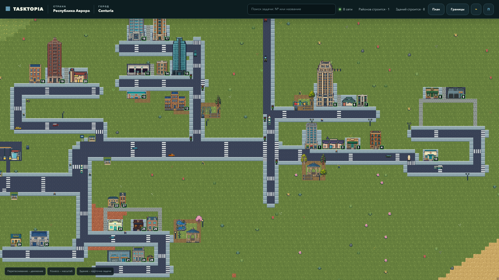
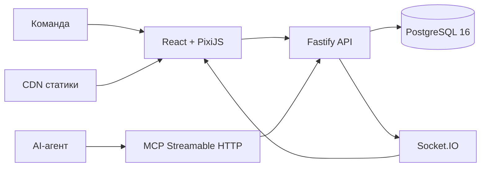

<p align="center">
  
</p>

<h1 align="center">Tasktopia</h1>

<p align="center">
  <strong>Open-source задачник для команд и AI-агентов, где прогресс проекта становится живым пиксельным городом.</strong>
</p>

<p align="center">
  <a href="https://tasktopia.online">Открыть Tasktopia</a> ·
  <a href="https://tasktopia.online/ai.md">Подключить AI</a> ·
  <a href="docs/MCP.md">Документация MCP</a> ·
  <a href="docs/DEPLOYMENT.md">Развернуть на своём сервере</a>
</p>

<p align="center">
  <a href="https://github.com/afkbot-io/tasktopia/actions/workflows/ci.yml"></a>
  <a href="LICENSE"></a>
  
  
  
</p>

## Работа, которую видно

Tasktopia хранит задачи, сроки, зависимости и ответственность, но показывает их не очередной доской с колонками. У каждого проекта появляется собственная страна. Эпики становятся городами, спринты — районами, а задачи — зданиями.

Началась работа — на карте появилась стройка. Задача движется к завершению — растёт здание. Найден дефект — над районом появляется дым, а к месту выезжает пожарная служба. Команда видит состояние проекта ещё до того, как откроет карточку задачи.



Tasktopia не превращает управление проектом в игру ради игры. Город — это визуальный слой над полноценным задачником и быстрый способ понять, где идёт работа, что остановилось и чему сейчас требуется внимание.

## Как читать город

| Рабочая сущность | В Tasktopia | Что видно на карте |
|---|---|---|
| Проект | Страна | Вся территория продукта и состав управления |
| Эпик или направление | Город | Отдельный центр развития со своей целью |
| Спринт или итерация | Район | Граница текущего объёма работы и дедлайн |
| Задача | Здание | Статус и прогресс строительства |
| Дефект или хотфикс | Инцидент | Дым, огонь и реакция городских служб |
| Контекст проекта | Государственный архив | Документы и знания, которые не теряются между сессиями |

## Что умеет Tasktopia

### Вести разработку

- задачи, баги, релизы и хотфиксы с приоритетом, SP, сроком и ответственным;
- зависимости, критерии приёмки, комментарии и история изменений;
- связанные дефекты с шагами воспроизведения, ожидаемым и фактическим результатом;
- чек-листы по плану реализации;
- документы задачи: системный анализ, архитектура, дизайн-система и план;
- роли и доступ на уровне страны;
- безопасное удаление задач, районов и городов вместе с их отображением в мире.

### Показывать живой мир

- карта подгружается чанками и не требует загружать всю страну при первом открытии;
- города и районы получают разные планировки, дороги, мосты, тротуары и общественные пространства;
- новые задачи временно получают только одно из 50 принятых V5-семейств новостроек; прежние типы не участвуют в автоматическом размещении;
- здания проходят пять стадий — от свободного участка до завершённого объекта;
- люди гуляют и общаются, транспорт соблюдает направления и дистанцию;
- парки, остановки, светофоры, деревья, животные, лодки и редкие события делают город живым;
- изменения приходят в реальном времени и обновляют только затронутую часть карты.

### Мир в цифрах

| Каталог | Количество |
|---|---:|
| Семейства зданий | 193 |
| Строительные стадии зданий | 965 |
| Props и городской декор | 208 |
| Модели транспорта | 8 |
| Terrain families | 12 |
| Все runtime PNG | 1 274 |
| Зарегистрированные MCP tools | 46 |

### Работать вместе с AI

Tasktopia предоставляет MCP Streamable HTTP API. AI-агент может находить нужный проект, создавать и декомпозировать задачи, вести чек-лист, обновлять документы и прогресс, регистрировать дефекты и завершать работу по тем же правилам, что и команда.

- отдельные отзываемые Bearer-токены;
- минимальные разрешения для каждой интеграции;
- idempotency key для безопасного повторения команд;
- проверка роли и доступа на каждом запросе;
- подтверждение операций удаления;
- публичная инструкция [`ai.md`](https://tasktopia.online/ai.md), которую можно сразу передать агенту.

## Запуск за несколько минут

Понадобятся Git, Docker Engine и Docker Compose v2.

```bash
git clone https://github.com/afkbot-io/tasktopia.git
cd tasktopia
cp deploy/.env.self-host.example .env
```

Создайте пароль:

```bash
openssl rand -hex 32
```

Запишите его в `POSTGRES_PASSWORD` внутри `.env`, затем запустите Tasktopia:

```bash
docker compose up -d --build
docker compose ps
curl -fsS http://127.0.0.1:3000/health
```

Откройте [http://localhost:3000](http://localhost:3000) и создайте аккаунт. Вместе с ним появятся первая страна, Государственный архив и первый город.

Данные PostgreSQL и пользовательские файлы сохраняются в Docker volumes. Приложение работает не от root и по умолчанию доступно только через `127.0.0.1:3000`.

## Установка на сервер с HTTPS

Направьте домен на Ubuntu/Debian-сервер и запустите установщик:

```bash
git clone --depth 1 https://github.com/afkbot-io/tasktopia.git /tmp/tasktopia-bootstrap
sudo /tmp/tasktopia-bootstrap/deploy/install-server.sh \
  --domain tasks.example.com \
  --email admin@example.com
```

Установщик подготовит Docker, PostgreSQL, nginx и Certbot, создаст секреты, запустит сервисы и выпустит TLS-сертификат. По умолчанию приложение устанавливается в `/srv/tasktopia/app`.

Обновление выполняется с предварительной резервной копией базы:

```bash
sudo /srv/tasktopia/app/deploy/update-server.sh
```

Параметры установки, CDN и ручной сценарий описаны в [руководстве по deployment](docs/DEPLOYMENT.md).

## Подключение MCP

1. Откройте настройки Tasktopia и перейдите в «MCP-интеграции».
2. Выпустите токен только с необходимыми разрешениями.
3. Скопируйте адрес `https://ваш-домен/mcp`.
4. Сохраните токен в secret storage вашего MCP-клиента.

```json
{
  "mcpServers": {
    "tasktopia": {
      "url": "https://tasks.example.com/mcp",
      "headers": {
        "Authorization": "Bearer ttp_mcp_..."
      }
    }
  }
}
```

Типичный рабочий цикл агента:

```text
выбрать страну → найти город и район → создать или взять задачу
→ заполнить план и чек-лист → сообщать прогресс → обработать дефекты
→ проверить результат → завершить задачу
```

Названия инструментов, scopes и примеры запросов находятся в [документации MCP](docs/MCP.md).

## Архитектура



- **PostgreSQL** хранит рабочие сущности и геометрию мира.
- **Fastify** обслуживает авторизацию, API, MCP и генерацию карты.
- **React** отвечает за управление проектом и карточки задач.
- **PixiJS** отрисовывает карту, анимацию и потоковую загрузку чанков.
- **Socket.IO** доставляет изменения только в затронутые области города.

Подробнее: [архитектура](docs/ARCHITECTURE.md), [генерация мира](docs/WORLD-GENERATION.md), [здания](docs/BUILDINGS.md), [страны и доступ](docs/COUNTRIES-AND-ACCESS.md).

## Разработка

Для локальной разработки нужны Node.js 24+, npm и PostgreSQL 16.

```bash
npm ci
cp .env.example .env
docker compose -f docker-compose.yml -f docker-compose.dev.yml up -d postgres
npm run seed
npm run dev
```

Основные проверки:

```bash
npm run test:db:start
npm run typecheck
npm run lint
npm test
npm run build
npm run test:e2e
npm run assets:verify
npm run test:db:stop
```

Тяжёлые сценарии генерации мира вынесены в отдельную команду `npm run test:worldgen` и не запускаются вместе с обычным набором тестов.

Правила разработки и обязательные проверки описаны в [CONTRIBUTING.md](CONTRIBUTING.md).

## Структура репозитория

```text
src/client/                интерфейс и PixiJS-карта
src/server/                API, MCP, авторизация и генерация мира
src/shared/                общие DTO и контракты
assets/pixel-city-pack/ исходники и спецификация графического пака
public/game-assets/v5/     готовые игровые ресурсы
tests/                     unit, integration и browser-тесты
deploy/                    Docker, nginx, HTTPS и обновление сервера
docs/                      архитектура и эксплуатационная документация
```

## Безопасность

- браузерная сессия хранится в `HttpOnly` cookie;
- MCP использует отдельные отзываемые токены, а в базе хранится только их hash;
- PostgreSQL не публикуется в интернет стандартной установкой;
- секреты передаются через environment и не попадают в Docker image;
- операции удаления требуют явного подтверждения.

Об уязвимостях сообщайте через private security advisory согласно [SECURITY.md](SECURITY.md).

## Лицензия

Tasktopia распространяется по лицензии [MIT](LICENSE). Проект можно использовать, изменять, распространять и применять коммерчески при сохранении copyright notice и текста лицензии.

---

<p align="center"><strong>Не перекладывайте карточки. Стройте проект, движение которого видно.</strong></p>
