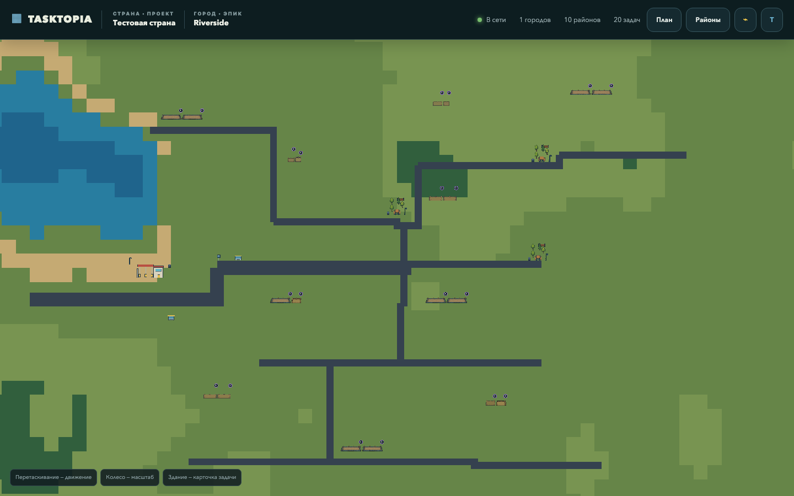

# Tasktopia

Tasktopia — цифровая страна: люди развивают города и районы, а каждая задача становится зданием с пятью стадиями строительства.



## Что работает

- регистрация с названием первой страны и города, вход, переименование, неограниченное количество стран и выбор активной страны;
- правительство страны: приглашение министров и наблюдателей по email, совместный доступ и защищённая роль главы страны;
- настройки ФИО и персональный MCP-ключ с выбранными scopes и сроком 30, 90 или 365 дней;
- детерминированная бесконечная квадратная карта с клеткой `8×8 px` и чанками `64×64`;
- трава, луга, смешанный лес с полянами, холмы, горы, песок, глина, камень, реки и озёрные бассейны;
- города с начальным резервом `100×100`, компактным транспортным узлом, квартальной застройкой и общей магистральной сетью;
- один Государственный архив на страну: отдельный от городов краткий справочник проекта и комплекс из четырёх уникальных корпусов, который растёт вместе с числом записей;
- мосты там, где дорога пересекает воду;
- постоянный PixiJS viewport с обзорным LOD, четвертью экрана prefetch, ограниченным параллелизмом, Brotli/gzip-сжатием чанков и точечной перерисовкой изменившейся области;
- связные районы пяти архетипов, скрываемые внешние границы, квартальные группы участков и безопасное расширение целыми блоками;
- плотные кварталы новостроек `3×3`, улицы частных домов и коммерческие полосы с общим пешеходным доступом вместо лабиринта подъездных дорог;
- двухполосные local/collector улицы, четырёхклеточные arterial/highway, тротуары, коричневые дорожки и подъезды к реальным входам зданий;
- городские знаки, три визуально разные семьи остановок и крупные придорожные АЗС на длинных соединениях;
- детерминированные парки и рощи внутри районов: по три композиции каждого типа, пять разных игровых объектов, скамейки, пруды, фонтаны, эстрады, урны, фонари и 15 основных видов деревьев;
- задачи с оценкой `1 | 2 | 3 | 6`, приоритетом, сроком, описанием, создателем, ответственным, комментариями и неизменяемой хроникой;
- пять статусов и пять настоящих PNG-стадий каждого здания;
- 50 семейств зданий, 250 строительных кадров, платформы, транспорт и городской декор;
- автоматический выбор здания по смыслу задачи, архетипу района, дефициту служб, квотам и seed;
- безопасное удаление задач, районов и городов из веб-плана и MCP; удаление задачи освобождает участок, а каскадные операции убирают принадлежащую геометрию;
- атомарная перегенерация страны с сохранением всех рабочих сущностей, статусов, ответственных, комментариев и истории;
- полиция, пожарная часть и медицина в зрелом городе; локальные машины и пешеходы сохраняют маршрут при навигации по карте и выбирают новые позиции после перезагрузки;
- редкий пиксельный самолёт над картой и бюджетированные анимированные лодки/рыбаки без дополнительных запросов;
- восемь самостоятельных моделей машин с отдельно нарисованными горизонтальными и вертикальными проекциями, лёгкая анимация транспорта и шага людей;
- связка коротких разрывов тротуара через безопасную землю, переходы, уступающие машины и остановки людей у городских объектов;
- MCP Streamable HTTP с Bearer-токеном, динамической проверкой роли, expiry, idempotency и least-privilege scopes;
- обновление карты через Socket.IO с `affectedBounds`: новая задача или стадия перестраивает только затронутые чанки, без пересоздания canvas;
- Docker Compose, nginx HTTPS, healthcheck и CI.

В runtime нет ИИ, LLM или внешней генерации. Мир `square-v7` и выбор зданий воспроизводимы; разнообразие задаётся versioned manifest, правилами, квотами и seed. ИИ можно использовать офлайн только как источник эскиза, после чего спрайт проходит нормализацию и валидацию.

## Быстрый запуск

Нужны Node.js 24+ и PostgreSQL 16 (локально можно использовать Docker).

```bash
npm ci
docker compose up -d postgres
npm run seed
npm run dev
```

Откройте [http://localhost:5173](http://localhost:5173).

Локальная учётная запись для проверки:

```text
demo@tasktopia.local
tasktopia-demo
```

При регистрации веб-интерфейс атомарно создаёт аккаунт, первую страну, её Государственный архив и первый город. Страна содержит города, города — районы, а каждая задача отображается отдельным зданием. Архив хранит только короткий устойчивый контекст проекта; активная работа остаётся в задачах. Дальнейшее управление выполняется через MCP/API.

Минимальный HTTP-контракт onboarding:

```http
POST /api/auth/register
Content-Type: application/json

{
  "email": "owner@example.com",
  "name": "Имя владельца",
  "password": "не менее 8 символов",
  "countryName": "Название страны",
  "cityName": "Первый город"
}
```

Переименование активной или доступной страны выполняет только её глава: `PATCH /api/countries/:countryId` с JSON `{ "name": "Новое название" }`. Браузер использует защищённую HTTP-only session cookie; MCP использует отдельный Bearer-токен.

## Подключение MCP

Production endpoint: `https://tasktopia.online/mcp`. Транспорт — Streamable HTTP, авторизация — заголовок `Authorization: Bearer <ключ>`.

1. Откройте «MCP-интеграции» в верхней панели или нажмите «Подключить MCP» в новой стране.
2. Скопируйте URL подключения.
3. Создайте ключ, выберите срок и минимально необходимые разрешения.
4. Добавьте URL и Bearer-ключ в MCP-клиент. Токен не следует помещать в query string.

Интерфейс показывает готовые параметры подключения и секрет только один раз. Публичную инструкцию [https://tasktopia.online/ai.md](https://tasktopia.online/ai.md) можно напрямую передать ИИ или разработчику; внутренние детали находятся в [MCP-контракте](docs/MCP.md).

## Проверки

```bash
npm run typecheck
npm run lint
npm run test:db:start
npm test
npm test -- --coverage
npm run build
npm run test:e2e
npm run smoke:mcp
npm run test:scale
npm run test:worldgen
npm run test:db:stop
```

`npm test` и `test:scale` используют только малый мир: один город, 10 районов и 20–25 задач. Интеграционные файлы PostgreSQL выполняются последовательно и не конкурируют за CPU/соединения. Scale-проверка контролирует связность, отсутствие пересечений, девять чанков и бюджет `512 MB RSS`. Тяжёлая регрессия роста и перегенерации 29 задач вынесена в отдельный `npm run test:worldgen`; её не запускают одновременно с обычным набором или E2E. Профили на много городов и сотни задач удалены: реальный мир растёт постепенно, а не создаётся одной тестовой транзакцией.

```bash
npm run seed:test
```

Этот seed также используется Playwright по умолчанию и создаёт ровно один город, 10 районов и 20 задач.

## Генерация ассетов

Готовый runtime pack уже находится в репозитории. Для пересборки нужен Python 3:

```bash
npm run assets:setup
npm run assets:build
```

Все 193 семейства описаны в едином `assets/pixel-city-pack-v4/catalog/buildings.json`. Для принятого семейства там указан проверенный пятистадийный sheet из `reference/buildings/<key>/stages.png`, его SHA-256 и `reviewed: true`. Сборка отклоняет отсутствующий или изменённый после проверки sheet; TypeScript-код при замене графики существующего ключа менять не нужно.

## Структура

```text
src/shared/                         DTO и runtime-каталог
src/server/                         Fastify, PostgreSQL, auth, генерация и MCP
src/client/                         React и PixiJS-карта
assets/pixel-city-pack-v4/          исходный каталог, ТЗ и runtime pack
public/game-assets/v4/              ассеты, отдаваемые вебу
scripts/                            seed, asset builder, smoke и scale tests
tests/                              geometry, service, catalog и Playwright
docs/                               эксплуатационная документация
.agent/plans/_misc/square-world-generation-v3/  полная архитектура
```

Документы:

- [каталог и расширение зданий](docs/BUILDINGS.md)
- [архитектура, сущности и жизненные циклы](docs/ARCHITECTURE.md)
- [строгое ТЗ на генерацию спрайтов](assets/pixel-city-pack-v4/docs/GENERATION-SPEC.md)
- [MCP-контракт](docs/MCP.md)
- [публичная инструкция для ИИ](public/ai.md)
- [размещение на сервере](docs/DEPLOYMENT.md)
- [актуальная генерация мира](docs/WORLD-GENERATION.md)
- [страны, правительство и права доступа](docs/COUNTRIES-AND-ACCESS.md)
- [QA релиза 1.3](docs/QA-1.3.md)
- [QA релиза 1.4](docs/QA-1.4.md)
- [история изменений](CHANGELOG.md)
- [архитектура дорожной геометрии v7](.agent/plans/_misc/road-zoning-v7/architecture.md)

## Эксплуатационные границы

Runtime и тесты используют асинхронный пул PostgreSQL 16; миграции применяются под advisory lock и сверяются по SHA-256. Лёгкий bootstrap не содержит районы, участки или задачи; клиент держит только viewport и малый prefetch-ring. Геометрия выбирается через триггерный индекс принадлежности сущностей чанкам, а план города получает города cursor-страницами. Для нескольких процессов приложения всё ещё нужен общий Socket.IO broker, чтобы распределять realtime-события и invalidation.

Старую SQLite-базу можно проверить и перенести, не изменяя исходный файл:

```bash
npm run db:import-sqlite -- --source ./data/tasktopia.db --database-url "$DATABASE_URL" --dry-run
npm run db:import-sqlite -- --source ./data/tasktopia.db --database-url "$DATABASE_URL"
```
