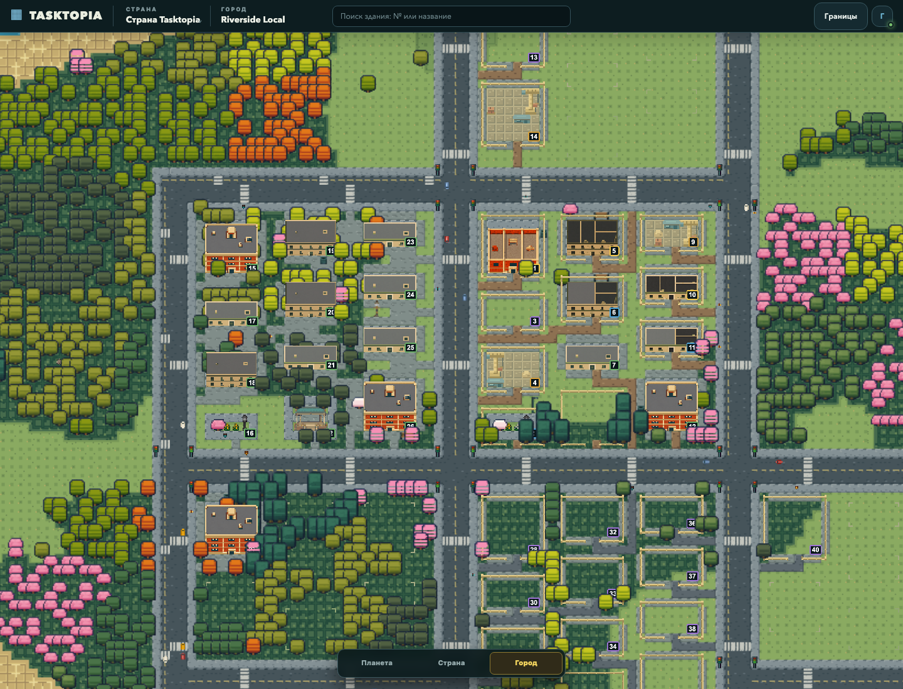
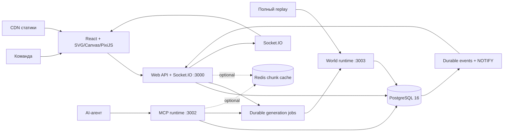

<p align="center">
  
</p>

<h1 align="center">Tasktopia</h1>

<p align="center">
  <strong>Open-source задачник для команд и AI-агентов, где прогресс проекта становится живым пиксельным городом.</strong>
</p>

<p align="center">
  <a href="https://tasktopia.online">Открыть Tasktopia</a> ·
  <a href="https://tasktopia.online/ai.md">Подключить AI</a> ·
  <a href="docs/MCP.md">Документация MCP</a> ·
  <a href="docs/DEPLOYMENT.md">Развернуть на своём сервере</a>
</p>

<p align="center">
  <a href="https://github.com/afkbot-io/tasktopia/actions/workflows/ci.yml"></a>
  <a href="LICENSE"></a>
  
  
  
</p>

## Работа, которую видно

Tasktopia хранит задачи, сроки, зависимости и ответственность, но показывает их не очередной доской с колонками. У каждого проекта появляется собственная страна. Эпики становятся городами, спринты — районами, а задачи — зданиями.

Началась работа — на карте появилась стройка. Задача движется к завершению — растёт здание. Дефекты и хотфиксы получают разные отметки отчёта, ремонта и проверки; активная авария сопровождается компактным огнём и визуальной реакцией службы. Это не симуляция выезда пожарной по маршруту. Команда видит состояние проекта ещё до того, как откроет карточку задачи.



Скриншот получен из приложения на тестовом городе с 40 задачами. Город переведён
на компактную сетку `город → район → прямоугольный квартал → слот`: задача
занимает свободный совместимый слот, затем создаётся соседний квартал с дорогами.
Три базовые геометрии — `compact-apartment-v1` (`48×48 px`, участок `6×6`),
`compact-row-v1` (`48×24 px`, `6×3`) и `compact-wide-v1` (`48×32 px`, `6×4`)
клеток по `8 px` — используют общий высокий фронтально-верхний ракурс 45° и
шаг этажа `4–6 px` по контракту конкретного семейства. Дома не растягиваются под чужой размер; плотные шаблоны
сохраняют проходы к входам, а подходящие остаточные участки становятся
task-слотами небольших парков. Процедурный стиль ландшафта и дорог сохраняется.
В каталог добавлены десять новых жилых семейств: бунгало, мастерская-дом,
террасный и парный дома, дом с садом на крыше, угловой балкон, стеклянная
лестница, ступенчатый корпус, внутренний дворик и мансарда. Восемь семейств
служб включают клинику, пожарную, полицию, школу, магазин, вокзал, аэровокзал
и администрацию. Для каждого отдельно нарисованы ИИ стадии `5→4→3`.
Дополнительно опубликованы синий дом с балконами и террасой и кирпичный дом
с оливковой ребристой крышей, длинная галерея (`12×6` клеток), Г-образный двор
(`8×8`), П-образный двор (`12×8`), библиотека, садовый дом, кирпичный лофт
и песочный дом с балконами. Автоматический выбор сначала использует менее
частые совместимые дома внутри квартала; равные варианты выбираются по seed.
Рисунок сохраняется отдельно от неизменной геометрии слота; новые семейства
не перепаковывают существующие кварталы. Семнадцать видов деревьев заменены
компактными `16×16 px` изображениями с проверкой расстояний между кронами.
Текущее состояние проверок и оставшиеся release-gates — в
[актуальном плане завершения](docs/RELEASE-COMPLETION-2026-09-07.md); наличие изображений само по себе
не означает разрешение на production-выгрузку.
Контракт, ограничения и breaking migration:
[COMPACT-BLOCK-CUTOVER](docs/COMPACT-BLOCK-CUTOVER.md). Это не сообщение о
выполненном production-релизе.

Tasktopia не превращает управление проектом в игру ради игры. Город — это визуальный слой над полноценным задачником и быстрый способ понять, где идёт работа, что остановилось и чему сейчас требуется внимание.

## Как читать город

| Рабочая сущность | В Tasktopia | Что видно на карте |
|---|---|---|
| Проект | Страна | Вся территория продукта и состав управления |
| Эпик или направление | Город | Отдельный центр развития со своей целью |
| Спринт или итерация | Район | Граница текущего объёма работы и дедлайн |
| Задача | Здание | Статус и прогресс строительства |
| Дефект или хотфикс | Инцидент | Дым, огонь и реакция городских служб |
| Контекст проекта | Государственный архив | Документы и знания, которые не теряются между сессиями |

## Что умеет Tasktopia

### Вести разработку

- задачи, баги, релизы и хотфиксы с приоритетом, SP, сроком и ответственным;
- зависимости, критерии приёмки, комментарии и история изменений;
- связанные дефекты с шагами воспроизведения, ожидаемым и фактическим результатом;
- чек-листы по плану реализации;
- документы задачи: системный анализ, архитектура, дизайн-система и план;
- роли и доступ на уровне страны;
- перенос задач между спринтами одного города с постоянным MOVE и ссылкой на текущую задачу; удаление оставляет занятые руины с ограниченной историей. История удаляется при удалении страны, а не обычной задачи.

### Показывать живой мир

- единая навигация `Планета → Страна → Город`: доступные страны образуют seed-материки; воздушные соединения используют только завершённые task-backed аэропорты;
- страна открывается компактным статическим pixel-raster, а выбранный город приходит одним атомарным scene-запросом; перемещение внутри города не запускает сетевую чанковую загрузку;
- города растут прямоугольными кварталами с типизированными слотами, общими дорогами и тротуарами; размещение не допускает неподготовленных водных переходов;
- каталог содержит 35 компактных семейств зданий (27 жилых и восемь служб), включая длинные горизонтальные и вертикальные корпуса, Г- и П-образные дома; парки, вода и парковка занимают собственные task-слоты. Большой прежний каталог удалён;
- здания проходят пять стадий, а ещё не занятые слоты показываются отдельной стадией 0 планировки;
- маленькие люди и автомобили используют отдельные top-down микроизображения; направления выбираются из подготовленных видов, животные имеют статичные позы;
- парки, остановки, светофоры, деревья, животные, лодки и редкие события делают город живым;
- пороги развития резервируют следующий свободный строительный слот под сервисную роль; реальная задача добавляется пользователем или авторизованной интеграцией, не генератором. Администрация резервируется после 18 занятых кварталов города; транспортный рисунок здания не заменяет реальные условия запуска маршрутов;
- COUNTRY v7 показывает один квартал одним зданием, PLANET v4 — один район одним зданием; CITY v4 получает общую сцену, отдельные снимки завершённых районов и ограниченный список соединений реальных аэропортов. Межгородские наземные дороги используют один сохранённый план; отсутствие сухопутного пути показывается явно, а не скрывается фиктивным мостом;
- мелкая случайная россыпь цветов, камней и травинок убрана из общего декора: фактура остаётся частью terrain-материала, а содержимое task-парков — отдельной осмысленной композицией;
- изменения приходят в реальном времени и обновляют только затронутую часть карты.

### Мир в цифрах

| Каталог | Количество |
|---|---:|
| Семейства зданий | 35 |
| Строительные стадии зданий | 175 |
| Props и городской декор | 106 |
| Модели транспорта | 4 |
| Микроизображения людей, машин, животных и самолёта | 36 |
| Terrain families | 12 |
| Все runtime PNG | 510 |
| Зарегистрированные MCP tools | 47 |

Число PNG включает весь `public/game-assets/v5`, в том числе атласы.
Четыре модели машин входят в новый `microAmbient`,
а прежний каталог крупных `vehicles` пуст. Это счётчик ресурсов, не заявление
о готовности всех транспортных механик или production-релизе.

### Работать вместе с AI

Tasktopia предоставляет MCP Streamable HTTP API. AI-агент может находить нужный проект, создавать и декомпозировать задачи, вести чек-лист, обновлять документы и прогресс, регистрировать дефекты и завершать работу по тем же правилам, что и команда.

- отдельные отзываемые Bearer-токены;
- минимальные разрешения для каждой интеграции;
- idempotency key для безопасного повторения команд;
- проверка роли и доступа на каждом запросе;
- подтверждение операций удаления;
- публичная инструкция [`ai.md`](https://tasktopia.online/ai.md), которую можно сразу передать агенту.

## Запуск за несколько минут

Понадобятся Git, Docker Engine и Docker Compose v2.

```bash
git clone https://github.com/afkbot-io/tasktopia.git
cd tasktopia
cp deploy/.env.self-host.example .env
```

Создайте пароль:

```bash
openssl rand -hex 32
```

Запишите его в `POSTGRES_PASSWORD` внутри `.env`, затем запустите Tasktopia:

```bash
docker compose up -d --build
docker compose ps
curl -fsS http://127.0.0.1:3000/health
```

Production-конфигурация закрывает публичную регистрацию. Создайте первого
пользователя из терминала сервера:

```bash
docker compose exec app npm run user:create -- \
  --email admin@example.com \
  --name "Администратор" \
  --country "Компания" \
  --city "Главный продукт"
```

Команда скрыто запросит пароль и подтверждение. После этого откройте
[http://localhost:3000](http://localhost:3000) и войдите созданной учётной
записью. Вместе с ней появятся первая страна, Государственный архив и первый
город.

### Закрытая регистрация для компаний

В production и в [`deploy/.env.self-host.example`](deploy/.env.self-host.example)
по умолчанию установлено `REGISTRATION_ENABLED=false`. В этом режиме интерфейс
показывает только вход, а прямой `POST /api/auth/register` возвращает `403`.
Создавать аккаунты может только оператор с доступом к Docker CLI — команда
`user:create` работает независимо от публичного флага регистрации.

Для автоматизации передавайте пароль и его подтверждение через stdin, а не как
аргумент процесса:

```bash
read -rsp "Пароль нового пользователя: " TASKTOPIA_NEW_USER_PASSWORD
printf '\n'
printf '%s\n%s\n' "$TASKTOPIA_NEW_USER_PASSWORD" "$TASKTOPIA_NEW_USER_PASSWORD" | \
  docker compose exec -T app npm run user:create -- \
    --email employee@example.com \
    --name "Сотрудник" \
    --country "Рабочее пространство сотрудника" \
    --city "Первое направление" \
    --password-stdin
unset TASKTOPIA_NEW_USER_PASSWORD
```

Если экземпляр действительно должен разрешать самостоятельную регистрацию,
явно задайте `REGISTRATION_ENABLED=true` в `.env` и пересоздайте app-контейнер.
На форме регистрации сервер и браузер требуют два совпадающих поля пароля.

Данные PostgreSQL и пользовательские файлы сохраняются в Docker volumes. Приложение работает не от root и по умолчанию доступно только через `127.0.0.1:3000`.

## Установка на сервер с HTTPS

Направьте домен на Ubuntu/Debian-сервер и запустите установщик:

```bash
git clone --depth 1 https://github.com/afkbot-io/tasktopia.git /tmp/tasktopia-bootstrap
sudo /tmp/tasktopia-bootstrap/deploy/install-server.sh \
  --domain tasks.example.com \
  --email admin@example.com
```

Установщик подготовит Docker, PostgreSQL, nginx и Certbot, создаст секреты, запустит сервисы, материализует атомарный каталог статики и выпустит TLS-сертификат. По умолчанию приложение устанавливается в `/srv/tasktopia/app`.

Обновление выполняется с предварительной резервной копией базы:

```bash
sudo git -C /srv/tasktopia/app pull --ff-only origin main
sudo /srv/tasktopia/app/deploy/update-server.sh
```

Параметры установки, CDN и ручной сценарий описаны в [руководстве по deployment](docs/DEPLOYMENT.md).

## Подключение MCP

1. Откройте настройки Tasktopia и перейдите в «MCP-интеграции».
2. Выпустите токен только с необходимыми разрешениями.
3. Скопируйте адрес `https://ваш-домен/mcp`.
4. Сохраните токен в secret storage вашего MCP-клиента.

```json
{
  "mcpServers": {
    "tasktopia": {
      "url": "https://tasks.example.com/mcp",
      "headers": {
        "Authorization": "Bearer ttp_mcp_..."
      }
    }
  }
}
```

Типичный рабочий цикл агента:

```text
получить countryId → найти город и район в этой стране → создать или взять задачу
→ заполнить план и чек-лист → сообщать прогресс → обработать дефекты
→ проверить результат → завершить задачу
```

Названия инструментов, scopes и примеры запросов находятся в [документации MCP](docs/MCP.md).

## Архитектура



- **PostgreSQL** хранит рабочие сущности и геометрию мира.
- **Fastify** запускается отдельными web, MCP и world-процессами с независимыми CPU/event loop и пулами БД.
- **Durable generation jobs** изолируют CPU/geometry work от карты и MCP; bounded timeout возвращает polling ID, не теряя принятую команду.
- **Redis** необязателен и используется только как fail-open content-addressed cache/singleflight; PostgreSQL остаётся источником истины.
- **React** отвечает за управление проектом и карточки задач.
- **SVG/Canvas/PixiJS** разделяют уровни карты: PLANET использует SVG, COUNTRY — статический pixel-raster и DOM aircraft, CITY — PixiJS; серверные чанки остаются внутренней проекцией хранения, но не единицей сетевой навигации внутри города.
- **Socket.IO** доставляет изменения только в затронутые области города.

Подробнее: [архитектура](docs/ARCHITECTURE.md), [генерация мира](docs/WORLD-GENERATION.md), [здания](docs/BUILDINGS.md), [страны и доступ](docs/COUNTRIES-AND-ACCESS.md).

## Разработка

Для локальной разработки нужны Node.js 24+, npm и PostgreSQL 16.

```bash
npm ci
cp .env.example .env
docker compose -f docker-compose.yml -f docker-compose.dev.yml up -d postgres
npm run seed
npm run dev
```

Основные проверки:

```bash
npm run test:db:start
npm run typecheck
npm run lint
npm test
npm run build
npm run test:e2e
npm run assets:compact:verify
npm run assets:verify
npm run test:db:stop
```

Тяжёлые сценарии генерации мира и десятигородской atlas запускаются локально
перед релизом и не расходуют GitHub Actions runner:

```bash
npm run test:db:start
npm run test:release-world
npm run test:db:stop
```

Правила разработки и обязательные проверки описаны в [CONTRIBUTING.md](CONTRIBUTING.md).

## Структура репозитория

```text
src/client/                интерфейс и PixiJS-карта
src/server/                API, MCP, авторизация и генерация мира
src/shared/                общие DTO и контракты
assets/pixel-city-pack/ исходники и спецификация графического пака
public/game-assets/v5/     готовые игровые ресурсы
tests/                     unit, integration и browser-тесты
deploy/                    Docker, nginx, HTTPS и обновление сервера
docs/                      архитектура и эксплуатационная документация
```

## Безопасность

- браузерная сессия хранится в `HttpOnly` cookie;
- production-регистрация закрыта по умолчанию, а CLI не принимает пароль в аргументах процесса;
- MCP использует отдельные отзываемые токены, а в базе хранится только их hash;
- PostgreSQL не публикуется в интернет стандартной установкой;
- секреты передаются через environment и не попадают в Docker image;
- операции удаления требуют явного подтверждения.

Об уязвимостях сообщайте через private security advisory согласно [SECURITY.md](SECURITY.md).

## Лицензия

Tasktopia распространяется по лицензии [MIT](LICENSE). Проект можно использовать, изменять, распространять и применять коммерчески при сохранении copyright notice и текста лицензии.

---

<p align="center"><strong>Не перекладывайте карточки. Стройте проект, движение которого видно.</strong></p>
