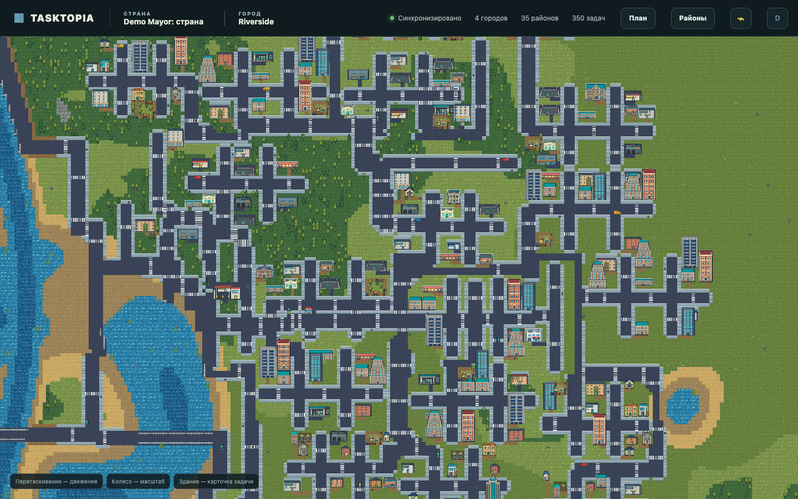

# Tasktopia MVP 0.7

Локальный задачник-игра: аккаунт развивает страны, города и районы, а каждая задача становится зданием с пятью стадиями строительства.



## Что работает

- регистрация, вход, неограниченное количество стран и выбор активной страны;
- палата страны: приглашение зарегистрированных людей по email, совместный доступ и защищённая роль основателя;
- настройки ФИО и персональный перевыпускаемый MCP-ключ, работающий с выбранной страной;
- детерминированная бесконечная квадратная карта с клеткой `8×8 px` и чанками `64×64`;
- трава, луга, смешанный лес с полянами, холмы, горы, песок, глина, камень, реки и озёрные бассейны;
- города с начальным резервом `100×100`, компактным hub, районными улицами и общей highway-сетью;
- мосты там, где дорога пересекает воду;
- viewport с запасом чанков `0.75` экрана по каждой стороне и ограничением камеры опубликованной областью страны;
- связные районы пяти архетипов, скрываемые внешние границы, резерв участков и безопасное расширение;
- двухполосные local/collector улицы, четырёхклеточные arterial/highway, тротуары, коричневые дорожки и подъезды к реальным входам зданий;
- городские знаки, остановки и крупные придорожные АЗС на длинных соединениях;
- детерминированные парки и рощи внутри районов: прогулочные поверхности, площадки, скамейки, столы, урны, фонари и деревья;
- задачи с оценкой `1 | 2 | 3 | 6`, приоритетом, сроком, описанием, создателем, ответственным, комментариями и неизменяемой хроникой;
- пять статусов и пять настоящих PNG-стадий каждого здания;
- 46 семейств зданий, 230 строительных кадров, платформы, транспорт и городской декор;
- автоматический выбор здания по смыслу задачи, архетипу района, дефициту служб, квотам и seed;
- полиция, пожарная часть и медицина в зрелом городе; локальные машины и пешеходы на дорожном и прогулочном графах;
- широкие вертикальные машины с корректным направлением, лёгкая анимация транспорта и шага людей;
- связка коротких разрывов тротуара через безопасную землю, переходы, уступающие машины и остановки людей у городских объектов;
- MCP Streamable HTTP, персональная авторизация, выбор страны, idempotency и scoped-доступ;
- обновление карты через Socket.IO, трёхуровневый план города и подробная карточка задачи;
- Docker Compose, nginx HTTPS, healthcheck и CI.

В runtime нет ИИ, LLM или внешней генерации. Мир `square-v7` и выбор зданий воспроизводимы; разнообразие задаётся versioned manifest, правилами, квотами и seed. ИИ можно использовать офлайн только как источник эскиза, после чего спрайт проходит нормализацию и валидацию.

## Быстрый запуск

Нужен Node.js 24+.

```bash
npm ci
npm run seed
npm run dev
```

Откройте [http://localhost:5173](http://localhost:5173).

Демо-вход:

```text
demo@tasktopia.local
tasktopia-demo
```

Управление городами, районами и задачами в MVP выполняется через MCP/API. Веб-интерфейс показывает карту и план, карточки задач, страны, палату, аккаунт и персональный MCP-доступ.

## Проверки

```bash
npm run typecheck
npm run lint
npm test
npm run build
npm run test:e2e
npm run smoke:mcp
npm run test:scale
npm run test:review-worldgen
npm run test:review-worldgen:soak
```

`test:scale` создаёт в памяти 10 городов, 80 районов и 250 задач, проверяет единую компоненту дорог, связность районов, отсутствие пересечений и загрузку 90 чанков.

`test:review-worldgen` создаёт контрольную страну из трёх городов: в каждом ровно три района и 30 задач. `test:review-worldgen:soak` повторяет тот же сценарий на десяти seed и проверяет доступ зданий и зелёных зон, мосты, границы, пересечения, разнообразие и время генерации.

## Генерация ассетов

Готовый runtime pack уже находится в репозитории. Для пересборки нужен Python 3:

```bash
npm run assets:setup
npm run assets:build
```

Процедурные варианты описываются в `assets/pixel-city-pack-v4/catalog/generated-buildings.json`. Нарисованные вручную пять стадий подключаются через `catalog/imported-buildings.json` и каталог `sources/`. TypeScript-код при добавлении обычного варианта менять не нужно.

## Структура

```text
src/shared/                         DTO и runtime-каталог
src/server/                         Fastify, SQLite, auth, генерация и MCP
src/client/                         React и PixiJS-карта
assets/pixel-city-pack-v4/          исходный каталог, ТЗ и runtime pack
public/game-assets/v4/              ассеты, отдаваемые вебу
scripts/                            seed, asset builder, smoke и scale tests
tests/                              geometry, service, catalog и Playwright
docs/                               эксплуатационная документация
.agent/plans/_misc/square-world-generation-v3/  полная архитектура
```

Документы:

- [каталог и расширение зданий](docs/BUILDINGS.md)
- [строгое ТЗ на генерацию спрайтов](assets/pixel-city-pack-v4/docs/GENERATION-SPEC.md)
- [MCP-контракт](docs/MCP.md)
- [размещение на сервере](docs/DEPLOYMENT.md)
- [актуальная генерация мира](docs/WORLD-GENERATION.md)
- [страны, палата и права доступа](docs/COUNTRIES-AND-ACCESS.md)
- [QA версии 0.7](docs/QA-0.7.md)
- [история изменений](CHANGELOG.md)
- [архитектура дорожной геометрии v7](.agent/plans/_misc/road-zoning-v7/architecture.md)

## Граница MVP

SQLite рассчитан на один экземпляр приложения. Сейчас генерация синхронная, природный слой вычисляется на запрос чанка, а клиент держит только viewport и prefetch-ring. Для горизонтального масштабирования потребуются PostgreSQL, очередь generation jobs и общий event broker, но публичные сущности и manifest-контракт менять не придётся.
