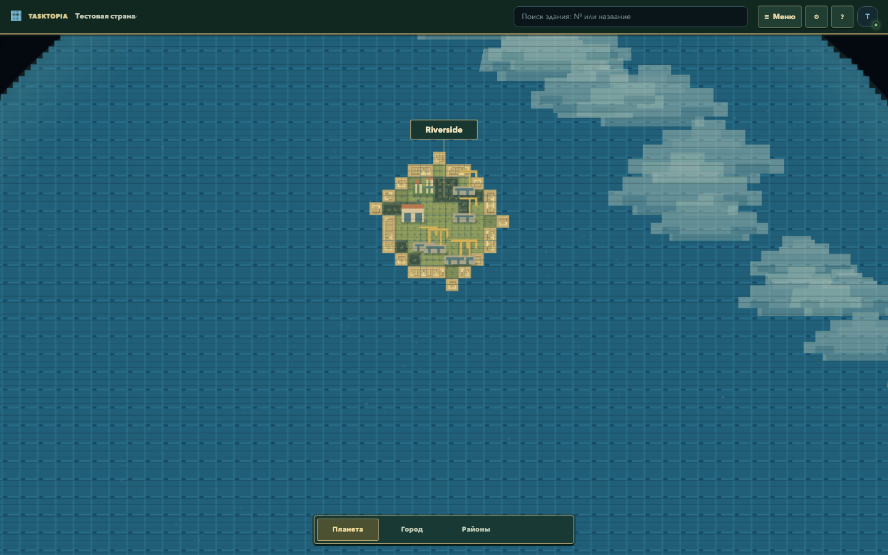
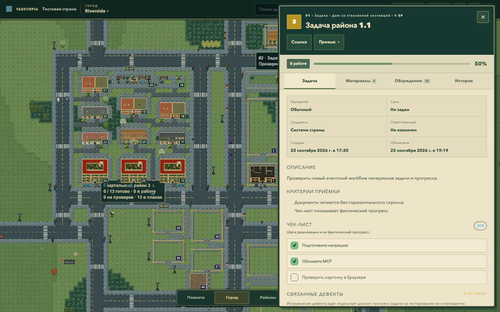

# Планета → Город → Районы и игровой интерфейс

Реализация задачи [№43](https://tasktopia.online/task/43?countryId=4201d605-751a-469b-8d5f-a7e322a7ece1&taskId=f59e7e3b-f558-47a3-9cd3-a4a5863f2d58), база `330b48708449be3adc6ddd476eca7a75c7426dae`, ветка `codex/planet-city-ui`. Исходная [согласованная концепция](research/planet-city-districts-proposal-2026-09-22.md) отделена от фактически реализованного поведения. Изменения подготовлены для ревью; на dev/prod не выкладывались.

## Что изменилось

| Критерий | Реализация | Основное доказательство |
| --- | --- | --- |
| AC001 — три понятных пункта карты | Два уровня `PLANET / CITY`; Районы включают слой той же сцены. Режим страны удалён. Клик издалека приближает город, ближний клик, Enter или продолжение zoom открывают его. Камеры сохраняются. | `planet-city-ui`, `planet-navigation`, `planet-city-races`, `navigation-cache`, `mobile-pwa` |
| AC002 — маленькие города | 24 SVG-модуля, состав и площадь по реальной застройке; пустой город не выглядит готовым. Крупные CITY PNG на планете не загружаются. Подписи городов появляются при приближении, пересечения скрываются; полное имя остаётся доступным для клавиатуры. | `planet-city-targets`, `planet-navigation`, `atlas-pixel-zoom`, контактный лист |
| AC003–004 — единый игровой UI | Одна строка управления, меню и фильтры с индикатором активности и сбросом; План удалён. Города с поиском, районы и архив открываются по контексту. Задача: четыре вкладки, сохранённые действия/материалы/история, заметный индикатор дефектов. Общая палитра хвои, латуни и бумаги для форм и диалогов. | `game-interface`, `app`, `map-attention`, `district-development`, Axe в `planet-city-ui` |
| AC005 — загрузка | Один HTTP-снимок города, нет скрытого Pixi до намерения входа; ограниченные предварительная загрузка и DTO-кэш. Первый кадр ждёт необходимую графику; до его готовности отключены анимация и перерисовки всей сцены под экраном загрузки. Повтор и отмена при ошибке; возврат переиспользует canvas. | `city-asset-overlap`, `map-retry`, `map-streaming`, `navigation-cache`, замеры ниже |
| AC006 — дороги | Полные сохранённые улицы соседних участков входят в необязательный `roadContext` CityScene v4. Дорога сохраняет ширину за границей resident-чанков, при pan и resize; межгородские маршруты остаются каноническими. | `city-road-padding`, `city-scene-route`, `intercity-road-runtime`, `planet-city-roads` |
| AC007 — атмосфера | Три силуэта ступенчатых облаков, облаков примерно на четверть больше, редкие блики поверх прежней воды, мерцание звёзд и мягкий край планеты. Настройка движения, системная настройка и скрытая вкладка останавливают анимацию. | `visible-animation`, `atlas-transport`, `world-preferences`, визуальная проверка Chromium/WebKit |
| AC008 — городская среда | Составные общественные пространства: места пикника, велостойки, площадки, прогулочные скамейки, сады и смешанные посадки. Смягчена плотность травяной текстуры; небольшие тени и декор размещаются с учётом занятости. Плашка района показывает готовые, активные, проверяемые и планируемые задачи. | `task-public-spaces`, `green-area-paths`, `compact-area-stages`, `district-development`, существующие пять профилей зданий |
| AC009 — жизнь | Заезд с реальной дороги в доступную парковку, остановка 7–16 секунд и выезд через общий контроллер движения. Строители и восемь типов фоновых сцен у завершённых зданий. | `city-parking`, `city-mobility`, `city-life`, браузерный `city-life-parking` |
| AC010 — детализация | Освещение всегда дневное, отдельный выбор убран. Auto / Полная / Экономная действительно меняют FPS, DPR, число акторов, кэш и эффекты. | `world-quality-budget`, `world-preferences`, `world-light-clock`, фиксированный нагрузочный замер |
| AC011 — совместимость | Права и сущность страны сохранены. Выбор мира сериализован; потерянный ответ сверяется с сервером без повторного POST. Отложенные операции отменяются при смене сессии. Нет миграций или записи задач от декоративных событий. | `country-selection`, `city-scene-route`, `planet-city-races`, AI-ревью и SCM-проверки PR |

## Жизнь города

Новосёлы, доставка, уход за двором, уличная музыка, праздник, уборка, уход за фасадом и учебный выезд выбираются детерминированно по городу, зданию и временному окну. Сцена длится 38 секунд с прибытием, действием и уходом. Одновременно активна не более одной; то же здание имеет паузу не менее 12 минут. Если подход недоступен или выбранное здание за экраном, замена не подбирается по движению камеры. Реальный дефект исключает декоративное событие. Учебный выезд использует существующую машину и обозначение, а не создаёт аварийный статус задачи.

Данные задач, сроки, прогресс и история от этих сцен не меняются. Это фоновая жизнь, не отдельная экономическая симуляция. Новые большие семейства зданий не добавлялись: разнообразие города использует существующий каталог, новые композиции парков и 24 отдельных картографических модуля.

## Проверки

Локально использовались production-сборка, изолированный PostgreSQL на порту 55432 и тестовые пользователи. Реальные пользовательские миры не перегенерировались.

- Сборка с TypeScript и ESLint проходят.
- Целевой набор: 20 модульных файлов, 89 тестов; дополнительно проверены отмена очереди при смене сессии и постоянное дневное освещение.
- Основной Chromium-прогон: 84 успешных сценария, 42 предусмотренных пропуска больших опциональных фикстур. Пять найденных несовместимостей старых тестов/UI исправлены и повторно проверены. Последующий набор затронутых сценариев и мобильный Chromium проходят, включая PWA и push.
- WebKit: 15 успешных сценариев; два push/offline сценария штатно пропускаются для этого движка и проверены в Chromium.
- Мир с несколькими городами: отмена перехода между проектами, возвраты без повторного scene GET, реальные дорожные края при изменении окна и перемещении камеры проходят.
- Парковка: 90 секунд моделирования четырёх машин без наложений и браузерный въезд/остановка/выезд. Браузерная проверка меняет семейство одного завершённого участка тестового DTO на парковку, сохраняя реальные дорогу и мощение; в стандартном Riverside готовой парковки нет. Записей в БД эта подмена не делает.
- Визуально просмотрены планета, город, набор миниатюр, карточка задачи, мобильный список и исправленный край дороги; Axe проверяет основные диалоги, меню и контраст.

Повторный CI на `556dd163` прошёл 1 393 модульных теста и 106 браузерных сценариев, выявив два сбоя. Мобильное меню перекрывалось предложением уведомлений: порядок слоёв исправлен, меню ограничено высотой экрана и прокручивается; заодно исправлены контраст подписей и ширина кнопок настроек. Перекрытие и контраст воспроизведены локально до исправления, затем проверки Chromium/WebKit прошли. Проверка парковки ошибочно ожидала окончания симуляции по настенным часам: трасса показала лишь 10,75 секунды симуляции за 26 секунд ожидания. Теперь тест повторяет сохранённое начальное состояние движения, прослеживает ту же машину до дороги и ограничивает ожидание 25 секундами симуляции. Таймауты измерений скорости приложения не менялись. Последующий Linux-прогон выявил лишние полные перерисовки под экраном подготовки города: API отвечал за 130–174 мс, но графическая очередь делила время с невидимой сценой. Теперь CITY ticker и промежуточная статическая отрисовка ждут готового первого кадра; затем согласованная сцена рисуется перед снятием экрана загрузки. Регрессия загрузки воспроизведена до исправления; затронутые переходы, отмена, пять профилей застройки, уменьшение движения и транспорт проверены локально. Полный итоговый CI указан в PR.

Удалённые COUNTRY-only браузерные тесты заменены проверками планетных подписей, пиксельного масштаба, прямого входа, движения транспорта и ошибок. Серверные проверки `/overview` и геометрии сохранены для совместимости. Опциональные тесты крупных городов переведены на новую навигацию, но их длительные прогоны в локальную приёмку не входят. Полный обязательный набор запускает CI PR, включая все unit-тесты, генерацию/проверку ассетов, recovery, MCP smoke, браузеры и audit; его результат привязан к SHA в PR.

## Скорость

Фактические результаты окончательной сборки приведены в таблице и JSON ниже. Сравнение использует одну PostgreSQL-фикстуру, локальные production-серверы, свежие браузерные контексты, отключённый HTTP-кэш, сеть 20/10 Mbps с задержкой 80 мс. Авторизация выполнена до открытия страницы. «Вход» измеряется от нажатия «Город» до `data-loading=false`, «возврат» — после посещения готовой планеты. Это не длительность загрузки всего сайта с авторизацией.

| Измерение | База 330b4870 | Новый интерфейс | Ориентир |
| --- | --- | --- | --- |
| Desktop, вход p95 (10 проб) | 1 231 мс | 954 мс | <2 000 мс |
| Desktop, медиана входа | 989 мс | 915 мс | — |
| Desktop, возврат p95 (10 проб) | 171 мс | 48 мс | <500 мс |
| Mobile 4× CPU, максимум из 3 входов | не измерялось | 1 534 мс | <4 000 мс |
| CITY scene GET / chunk+viewport GET за вход и возврат | 1 / 0 | 1 / 0 | 1 / 0 |
| Главный поток за 5 секунд, среднее двух окон | Полная: 5 029 мс | Экономная: 2 059 мс (−59,1%) | Снижение нагрузки |

При небольшом числе проб p95 вычислен методом ближайшего ранга. Медиана и p95 входа ниже базы, возврат также ускорился; это результат ограниченной выборки, а не гарантия для любого устройства. В каждом финальном desktop-прогоне сохранён тот же canvas, HTTP-ошибок нет. В сравнении детализации машин стало 8 вместо 17, прохожих — 12 вместо 29, строителей — 2 вместо 8; DPR 2→1, предел FPS 60→30, повторных ground rebuilds не прибавилось.

Исходные данные: [desktop](evidence/task43/navigation-performance.json), [мобильный профиль и детализация](evidence/task43/mobile-quality-performance.json), [идентификация измеренного исходного кода](evidence/task43/revision.json).

На desktop по пять повторов для Riverside с 40 задачами и мира навигации с 12–16 задачами в городе. База неизменна; её первоначальные замеры переиспользованы, финальный кандидат измерен отдельно. Мобильный профиль — эмуляция Chromium 390×844 DPR2 с замедлением CPU 4×, три повтора. Это не физический телефон и не доказательство масштабирования на тысячу задач.

Для детализации: тот же Riverside, неподвижная камера, 1440×900 DPR2, четыре чередующихся окна по 5 секунд после 1,5 секунды стабилизации. CDP `TaskDuration` включает работу главного потока браузера и не равен только JavaScript CPU. Headless-графика влияет на абсолютные величины. Heap между окнами не сравнивается из-за сборки мусора.

## Внешний вид

[Список городов на мобильном экране](evidence/task43/directory-mobile.png) · [24 картографических модуля](evidence/task43/miniature-modules.png).

## Проверка человеком

1. Открыть приложение: видна планета, внизу только Планета / Город / Районы. Приблизить реальный город, открыть подписью, затем вернуться. Повторить Enter и жестом на телефоне; камера не должна сбрасываться.
2. На планете приблизить воду между городами: случайный город не открывается. При медленной сети отменить вход или повторить после ошибки; проверить второй доступный мир.
3. Открыть поиск, задачу, все четыре вкладки и материал. Проверить Esc, Tab, стрелки вкладок, индикатор дефектов. В меню открыть города, найти город по имени; в городе открыть районы и задачи района.
4. Включить и сбросить фильтр, переключить районный слой. Проверить понятность сводки готовых и текущих работ.
5. Переместить камеру вдоль выезда и изменить размер окна: ширина дороги и соединения сохраняются. Подождать у доступной парковки и завершённых зданий; декоративные события не создают уведомлений о дефектах и не меняют задачи.
6. Сравнить Полную и Экономную детализацию, затем Auto. Уменьшить движение и выключить Жизнь города; карта и карточки продолжают работать. В узком окне меню и действия не выходят за экран.

## Ревью, совместимость и откат

AI-ревью проведено по контрактам, навигации, отмене асинхронных операций, изоляции доступа, загрузке, кэшам, геометрии, UI, тестам и исходным критериям. Исправлены обрезанная соседняя дорога, контраст нескольких диалогов, различение пустого и загружаемого списка, старые сценарии навигации и очередь выбора после выхода. Новые GET не планируют геометрию; `roadContext` читается только из той же страны. Старый DTO без поля работает, старый клиент игнорирует добавленное поле.

Новых зависимостей, схем БД и массовой генерации мира нет. Настройки v1 мигрируют только качество; прежнее ночное освещение не восстанавливается. Для отката достаточно вернуть исходный код предыдущей версии; серверные данные не требуют восстановления. Публикация и merge не входят в этот запрос. Окончательные SHA, CI и ссылка на изменение — в PR и пакете ревью задачи №43.
