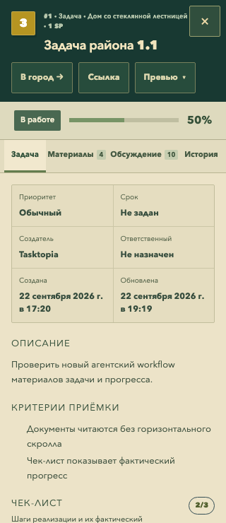
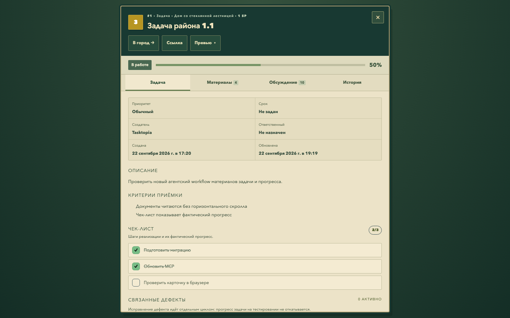

# Быстрый вход в задачу и проверка интерфейса

Дополнение задачи №43 и PR45. Прямые ссылки открывают полноценную карточку без предварительной загрузки города. Это касается браузера, навигации внутри установленной PWA и ссылок из уведомлений. Крестик, Escape и «В город» открывают город у соответствующего здания. При открытии задачи из уже загруженной карты сохраняется обычная боковая карточка.

Действующая ссылка с публичным превью для вошедшего участника возвращает 302 к канонической задаче: промежуточная страница и OG-картинка не загружаются. Гости и посторонние видят одобренный публичный снимок; отозванные ссылки дают 404. Членство и права проверяются сервером; приватные ответы и публичные ссылки не сохраняются Service Worker.

Начальный вход исключает импорт планеты, сцену, рендер и спрайты. Карточка подготавливается параллельно bootstrap, скрытые вкладки — при первом посещении. При ошибке есть повтор; закрытие во время поиска отменяет показ позднего результата. Истёкшая сессия возвращает вход и сохраняет исходную ссылку. Выбор другого мира согласован с серверной сессией.

В интерфейсе исправлены контраст вкладок, счётчиков, дат и подписей; добавлен фокус прокручиваемых разделов. Заголовки переносятся, не перекрывая крестик. На телефоне действия имеют высоту 44 px; при малой высоте окна прокручивается вся карточка. В текстах пустых разделов убраны служебные пояснения про MCP и AI. Состояние посещённых вкладок сохраняется до закрытия. Карточка учитывает безопасную область PWA: вырез экрана и нижнюю полосу жестов, в том числе в горизонтальной ориентации.

## Измерение

Локальные production-сборки до/после, один PostgreSQL, задача с четырьмя документами и десятью комментариями. Chromium, новая сессия браузера с готовой авторизацией, HTTP-кэш выключен, 10 Мбит/с вниз, 5 Мбит/с вверх, задержка 80 мс. Кандидат измерения — `1dacf81b774a01e20760bbdd68c8336da691d13f`, до последующих правок безопасной области и указателя района. По 3 повтора для каждого размера. Медианы, миллисекунды:

| Условие | Карточка до | После | Вкладка «Обсуждение» готова до | После |
| --- | ---: | ---: | ---: | ---: |
| Desktop 1440×900 DPR1 | 1661 | 1128 | 1685 | 1145 |
| Телефон 390×844 DPR2, CPU4× | 1917 | 1253 | 1984 | 1311 |

Объём завершённых сетевых ресурсов до переключения вкладки: примерно 654–657 КБ до, 180 КБ после. Сцены, карта и игровые спрайты до закрытия карточки не запрашиваются. Это небольшая лабораторная выборка, не гарантия для любых телефонов, сетей и размеров задач. Bootstrap и авторизованные данные всё ещё требуют сеть. [Исходные измерения и SHA256 изменённых исходников](evidence/task43/task-entry/performance.json).

## Проверка

- Сценарии Chromium и WebKit: карточка без карты, правильный город после закрытия, ошибка resolver/detail и повтор, закрытие до ответа, истёкшая сессия, другой доступный мир, клавиатура, узкое и низкое окно.
- Реальный Service Worker в мобильном Chromium: обычная ссылка, повторное открытие, redirect превью, отсутствие приватного CacheStorage. Для проверки его notificationclick-обработчика использовано синтетическое событие и реальный window-client; системный показ push и запуск установленного приложения операционной системой на физическом телефоне здесь не проверялись.
- API-контракт: участник получает 302/no-store; гость, посторонний и просроченная сессия — 200 публичного снимка; отозванный токен — 404. Прежние проверки resolver и кеша карточек сохранены.
- Chromium/CDP: безопасная область 390×844 с верхним отступом 47 и нижним 34 px; 844×390 с боковыми47 и нижним 21 px. Все границы карточки остаются внутри доступной области.
- Автоматический аудит 12 сочетаний «4 вкладки × 320/768/1440» не выявил нарушений WCAG A/AA в карточке. [Результат axe](evidence/task43/task-entry/accessibility.json). Скриншоты просмотрены вручную.
- Регрессионные проверки охватывают компактное меню, настройки качества, поиск, зависимости, возвращение к карте, парковку, фоновые события и создание/отзыв превью. Точный итоговый CI и ревизия указаны в PR45.

## Ревью и выпуск

AI-ревью изменений проверяет маршрутизацию, отмену асинхронных ответов, сессию и права при переходе между мирами, кеширование, клавиатуру и сохранение обычного пути из карты. Новый публичный HTTP-эффект ограничен редиректом уже авторизованного участника. Новых зависимостей и миграций нет, данные мира не меняются; откат выполняется возвратом к предыдущему коду. Merge и выкладка этим дополнением не запрошены.
