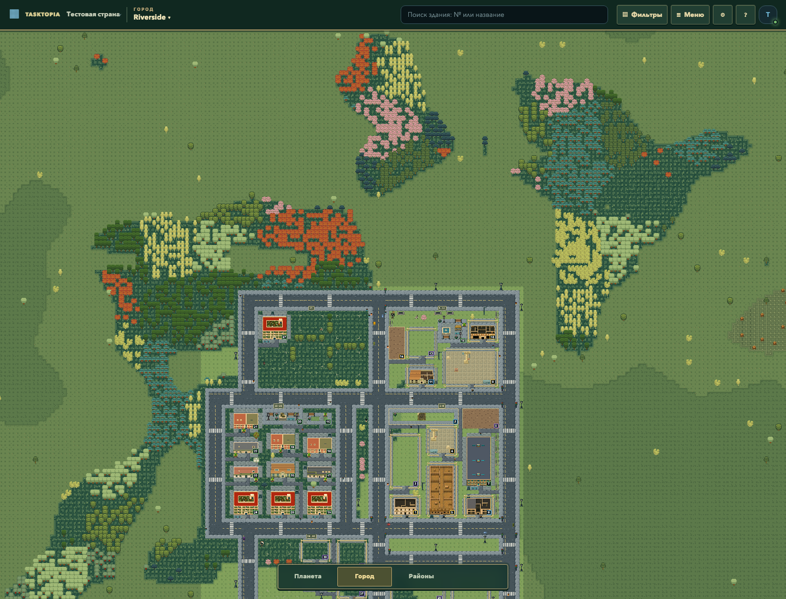
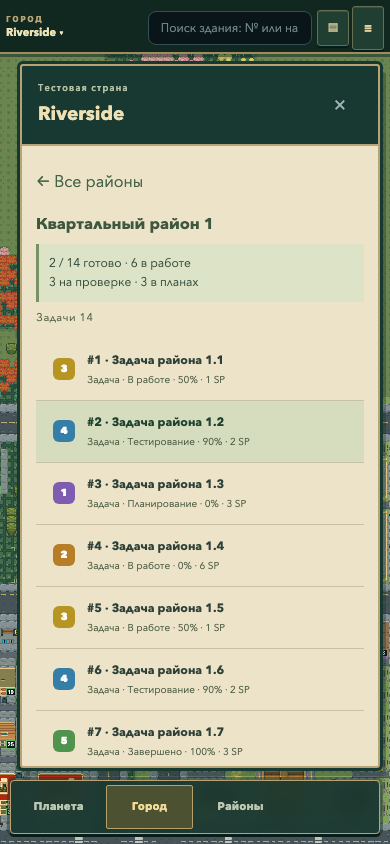
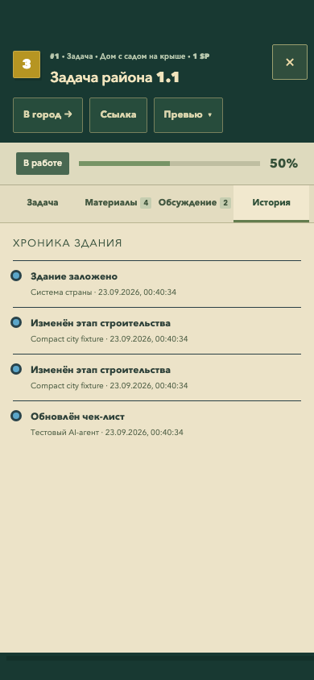
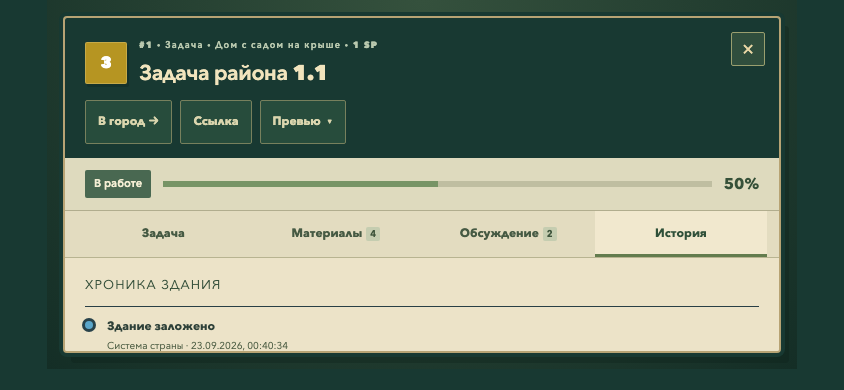

# Указатель района и безопасная область PWA

Уточнение пользователя от 23 сентября 2026 к задаче 43. Большая трёхстрочная плашка над углом района удалена. Её положение не учитывало соседнюю дорогу/здание. Остался авторский знак 16×16 px на проверенном свободном участке 2×2 клетки. Удалён дублирующий флаг на произвольном углу границы. Нажатие открывает боковой список со сводкой и задачами; при отсутствии места остаётся вход через название города в шапке. Координаты и данные мира не меняются.

Карточка задачи учитывает safe-area-inset во всех ориентациях. Кнопки закрытия/возврата списка на телефоне имеют область 44 px. Уточнён контраст вторичных подписей; убран повтор 0% у начатой задачи.

## Доказательства

- Production build с TypeScript, ESLint, 8 unit-проверок района проходят. Реальный Pixi проверяет полный размер знака, область нажатия и отсутствие графики при заполненном участке.
- Регрессия из 20 сценариев Chromium/WebKit: 17 прошли, 2 штатных пропуска (дублирующий axe и CDP в WebKit); обнаружен недостаточный контраст подписи списка. После исправления повторно прошли оба сценария районов. Итого 18 уникальных успешных сценариев, 2 ожидаемых пропуска.
- Проверены занятые клетки дорог, мощения, зданий, подходов, инфраструктуры и будущих участков; каждый знак остаётся внутри района. При pan/resize 1440×900,1440×1100, 390×844 координаты не меняются. Одна scene-загрузка, 0 viewport/chunk-запросов, 0 ошибок страницы. Нажатие, закрытие, повторное открытие и резервный вход через шапку работают. Axe в боковом списке: 0 нарушений A/AA.
- CDP: 390×844 с вырезом 47 px сверху и полосой 34 px снизу; 844×390 с боковыми 47 px и нижним 21 px. Границы карточки и крестик остаются внутри доступной области. Красный тест до исправления фиксировал y=0 вместо 47. Физическая установка PWA не проверялась.
- Итоговый полный CI привязан к точному SHA в PR45. Хеши локально проверенных исходников: [source-sha256.json](source-sha256.json).

## Проверка CI и лимит визуального сценария порта

CI 35789493153 на 6e241d33: 1 394 unit-теста прошли; в браузере 123 успешных сценария, 47 штатных пропусков и один общий timeout у пяти стадий порта. Trace подтверждает: все пять проверок стадии и все снимки завершены, ошибок страницы нет; итоговая последовательность заняла примерно 62 с при общем лимите 60 с. Готовность отдельных сцен занимала 1,3–2,7 с, завершение фоновой отрисовки всей земли 6,3–6,8 с. Общий лимит этого визуального сценария увеличен до 120 с; бюджеты отдельных ожиданий, производительности и утверждения не изменены. Последующий CI и точный итоговый SHA указаны в PR45.

## Независимые размеры окна

CI 35793535813 на 9db9653d: порт прошёл, но три размера окна нового теста указателя исчерпали общий лимит 60 с. Трасса подтверждает правильное размещение и открытие сводки на двух desktop-размерах; отдельные снимки занимали 1,4–1,9 с, двенадцать шагов pan — 8,5 с на программном рендере runner. Сбой возник на снимке второго размера из-за накопленного времени, до мобильной проверки.

Матрица разделена на три самостоятельных сценария с прежним общим лимитом 60 с на каждый. Координаты камеры считываются атомарно за один вызов браузера. В каждом сохранены проверки свободных клеток, pan/resize, открытия/закрытия сводки, резервного входа, одной scene-загрузки и отсутствия ошибок; мобильный сценарий сохраняет Axe и 44 px. Локально все три прошли за 12,5 с. Production-код не изменён.
