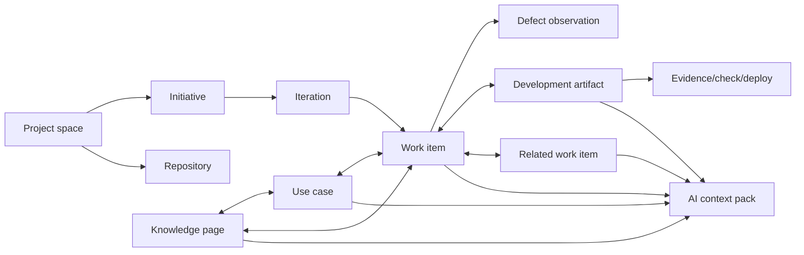

# AI-native product system for Tasktopia

Date: 2026-08-06

Status: product and architecture proposal; no runtime changes are implied by this document.

## 1. Problem Statement

### JTBD

When a human or AI agent starts or continues engineering work, it must be able to identify the correct project context, find prior decisions and related work, understand the repository and acceptance boundary, perform the change, and report evidence-backed progress without reconstructing context manually.

Tasktopia already models country/project, city/epic, district/iteration, task, linked defect, comments, append-only activity and evidence-oriented progress. Its MCP server supports safe CRUD and status transitions. It does not yet model:

- stable human-readable work item identifiers;
- task-to-task relations and hierarchy;
- repositories and repository ownership;
- branches, commits, pull/merge requests, checks, deployments and releases;
- product use cases and versioned knowledge pages;
- project-wide search;
- an AI context pack assembled from structured and documentary evidence.

The practical result is that an AI can update a known task, but cannot reliably answer “what already exists?”, “where is this implemented?”, “which decisions constrain this change?”, “which PR proves the progress?” or “is this a duplicate?” without using a second system and manually correlating identifiers.

### Five Whys

1. AI work loses context because task reads expose only the selected task and its comments.
2. Relevant information lives in code hosts, long-form documentation, related tasks and human memory.
3. Those objects have no canonical links or shared identifiers in Tasktopia.
4. Without a work graph, retrieval depends on names and unstructured text.
5. Adding embeddings alone would improve fuzzy matching but would not create ownership, dependencies, permissions, lifecycle or trustworthy progress evidence.

### Evidence from established products

- [Plane](https://github.com/makeplane/plane) combines work items, cycles, modules, initiatives, intake and pages; its [official MCP server](https://github.com/makeplane/plane-mcp-server) exposes search, relations, activities, work logs and pages. Its breadth validates the domain, but its 100+ tools are too large a surface to copy directly.
- [OpenProject](https://github.com/opf/openproject) treats task, feature, risk, user story, bug and change request as configurable work-package types and provides typed relations and hierarchies. Its [GitHub integration](https://www.openproject.org/docs/system-admin-guide/integrations/github-integration/) models pull requests and work packages as an n:m relation and displays PR state and checks inside the work item.
- OpenProject also links documentation directly from work packages. Its 2026 XWiki work adds bidirectional work-package/wiki references, while its [internal wiki](https://www.openproject.org/docs/user-guide/wiki/) supports links and embedded work-package views.
- [GitHub Issues](https://docs.github.com/en/issues/tracking-your-work-with-issues/learning-about-issues/about-issues) uses sub-issues, blocking dependencies, issue types, labels, milestones and repository-native references. A branch or PR can be linked to an issue and merge can close it through explicit keywords, not title similarity alone.
- [GitLab crosslinks](https://docs.gitlab.com/user/project/issues/crosslinking_issues/) connect issues to commits, branches and merge requests across projects and groups. The first commit becomes a measurable planning-to-implementation boundary.
- [Linear documents](https://linear.app/docs/documents) attach versioned long-form content to projects, issues and cycles and allow explicit `@` references. Linear Agent uses issues, relations, activity and documents under the user's existing permissions.
- GitHub's repository memory stores facts with code citations, validates them against the current branch and expires unused entries after 28 days. This is a stronger model than uncited permanent “AI memory”: [GitHub Copilot Memory](https://docs.github.com/en/copilot/concepts/agents/copilot-memory).
- GitLab Duo combines repository files, search API, knowledge graph, MCP and custom instructions while preserving access boundaries: [GitLab contextual awareness](https://docs.gitlab.com/user/duo_agent_platform/context/).

## 2. Three options

### Option A — Tracker plus repository links

Add stable task keys, task relations, repository connections and commit/PR/MR links. Add PostgreSQL full-text search over tasks and comments.

- Impact: medium/high.
- Confidence: high.
- Effort: M.
- Advantages: quickest path to useful repository traceability; low operational complexity.
- Limitations: weak long-form knowledge, no coherent AI context pack, semantic questions remain difficult.

### Option B — RAG-first knowledge assistant

Chunk all task and wiki text, generate embeddings, expose semantic search and chat summaries, then add repository links later.

- Impact: medium.
- Confidence: low/medium.
- Effort: M/L.
- Advantages: impressive natural-language discovery on a demo dataset.
- Limitations: embeddings do not establish authoritative relations, state, provenance or completion evidence. Permission filtering, staleness, deletion and hallucination become immediate risks. It optimizes retrieval before defining what is true.

### Option C — Work graph with hybrid retrieval

Build a provider-neutral graph of work items, use cases, knowledge pages, repositories and development artifacts. Use structured filters and PostgreSQL full-text search first, then add pgvector-based semantic ranking to long-form content. Expose compact search plus citation-rich context resources through MCP.

- Impact: very high.
- Confidence: high.
- Effort: L, deliverable incrementally.
- Advantages: best foundation for humans and AI; repository progress becomes auditable evidence; hybrid retrieval works without replacing canonical data.
- Limitations: requires deliberate domain boundaries, integration security and migration sequencing.

## 3. Recommendation

Choose Option C, delivered in vertical slices. RAG is a retrieval technique, not the system of record.

### Canonical language

| Tasktopia metaphor | Canonical product term | Meaning |
| --- | --- | --- |
| Country | Project space | Independent product/project boundary with membership, goals and integrations |
| City | Initiative | Durable outcome stream, epic or bounded product area |
| District | Iteration | Time-boxed or continuous delivery window with a goal and workload target |
| Building | Work item | Smallest independently verifiable unit of delivery |
| Linked defect | Defect observation | Reproducible failure linked to a work item and verified independently |
| Knowledge page | Document | Versioned long-form spec, ADR, runbook, research, domain note or release note |
| Use case | Product scenario | Actor goal and observable flow that can be implemented by multiple work items |
| Development artifact | Code evidence | Branch, commit, PR/MR, check, deployment or release from a connected repository |

“Wiki” should be the navigation experience, not the domain entity. Store typed `KnowledgePage` records. A use case should remain separate because it has actors, preconditions, main/alternate flows, outcome and acceptance evidence; flattening it into a wiki page would make coverage and search unreliable.

### Target work graph

### New domain entities

#### Stable work item identity

- `country_key`: short immutable key selected once, for example `TTP`.
- `work_item_number`: monotonically increasing sequence within the project space.
- display identifier: `TTP-123`.
- Renaming or moving a work item must not change the identifier. Old country keys must remain reserved so external links do not silently point somewhere else.

#### WorkItemRelation

Typed directed edges:

- `PARENT_OF` / `CHILD_OF`;
- `BLOCKS` / `BLOCKED_BY`;
- `DUPLICATES` / `DUPLICATED_BY`;
- `RELATES_TO`;
- `IMPLEMENTS`;
- `TESTS`;
- `SUPERSEDES`.

Relations need author, creation time and optional explanation. Blocking must affect completion; `RELATES_TO` must not.

#### RepositoryConnection and Repository

- provider: `GITHUB | GITLAB`;
- host URL for cloud or self-managed GitLab;
- provider installation/namespace identity;
- project-space ownership;
- repository external ID, full path, default branch, archived state and sync cursor;
- optional initiative binding for monorepo or multi-repository projects.

Use a GitHub App instead of a user PAT for GitHub. Use a GitLab OAuth application or project/group access token with explicit expiration for GitLab. Credentials needed for outbound API calls must be encrypted with a separate application key or secret manager; unlike MCP bearer keys they cannot be stored only as hashes.

#### DevelopmentArtifact

Provider-neutral record with `kind` (`BRANCH`, `COMMIT`, `PULL_REQUEST`, `MERGE_REQUEST`, `CHECK_RUN`, `PIPELINE`, `DEPLOYMENT`, `RELEASE`), repository, immutable provider ID, URL, SHA/ref, state, author identity, timestamps and a compact provider payload.

`TaskArtifactLink` is n:m and records provenance:

- `MANUAL`;
- `TASK_KEY_IN_BRANCH`;
- `TASK_KEY_IN_COMMIT_TRAILER`;
- `TASK_KEY_IN_PR_DESCRIPTION`;
- `PROVIDER_CROSSLINK`;
- `AI_SUGGESTED`.

AI-suggested links require confirmation; deterministic links can be accepted automatically and remain manually unlinkable.

#### UseCase

Required fields: identifier, title, actor, desired outcome, preconditions, trigger, main flow, alternate/error flows, postconditions, acceptance evidence, status and owner. Use cases link n:m to initiatives, work items, defects and knowledge pages. This provides an explicit “why and observable behavior” layer without turning every scenario into a task.

#### KnowledgePage and KnowledgeRevision

Page types: `PRODUCT_SPEC`, `DOMAIN`, `ADR`, `RUNBOOK`, `DESIGN`, `RESEARCH`, `MEETING_NOTE`, `RELEASE_NOTE`. Pages support hierarchy, explicit references, owner, review status, last verified timestamp and immutable revisions. Agent-written revisions identify the agent and remain reviewable/revertible.

### Search and retrieval

#### Stage 1: structured plus full-text search

Use PostgreSQL as the first search engine:

- a normalized `search_documents` projection for work items, defects, comments, use cases, knowledge pages and development artifact titles/summaries;
- `tsvector` with GIN indexes and weighted fields: identifier/title A, acceptance criteria/headings B, description/use-case flow C, comments/activity D;
- `websearch_to_tsquery` for forgiving user syntax and `ts_rank_cd` plus bounded boosts for exact identifier, current project, open state and recency;
- `pg_trgm` for identifier/title typo recovery and prefix suggestions;
- filters for entity type, initiative, iteration, status, assignee, label, repository, artifact state and date;
- authorization in the candidate query before ranking, never after retrieval;
- snippets that state the matched field and source.

PostgreSQL supports native full-text query parsing, weighting and ranking: [official text-search functions](https://www.postgresql.org/docs/current/functions-textsearch.html).

#### Stage 2: hybrid semantic retrieval

Add embeddings only for long-form descriptions, use-case flows, knowledge-page sections and selected artifact summaries. Chunk by document headings and semantic boundaries, not arbitrary fixed windows. Store source entity, revision, checksum, visibility boundary and model version with every chunk.

Combine full-text and vector candidates with Reciprocal Rank Fusion, then optionally rerank the small merged set. The pgvector project explicitly recommends combining vector retrieval with PostgreSQL full-text search for hybrid search: [pgvector](https://github.com/pgvector/pgvector#hybrid-search).

Do not embed raw repository content in the MVP. Code becomes stale rapidly and carries provider permissions. Search code on demand through the provider/client repository tools and store cited file/commit references plus reviewed repository facts.

#### AI Context Pack

`task.context` should assemble a bounded, versioned response:

1. project/initiative/iteration goals and constraints;
2. complete task contract and active defects;
3. parents, children, blockers and duplicates;
4. linked use cases and reviewed knowledge excerpts;
5. repository binding and active branches/PRs/MRs;
6. CI/check/deployment evidence;
7. recent material activity, decisions and blockers;
8. citations, source versions and retrieval explanations.

Return a compact default and allow explicit expansions. Never send every comment, document and diff in one MCP response.

### Repository workflow rule for the Tasktopia skill

1. Resolve the project space, initiative and iteration.
2. Search by identifier, title and semantic intent before creating a work item.
3. Read `task.context` and confirm blockers, acceptance criteria and repository binding.
4. Use branch format `<TASK-KEY>-<short-slug>`.
5. Include a provider-independent commit trailer: `Tasktopia-Work-Item: TTP-123`.
6. Include the Tasktopia work-item URL/key in the PR/MR description. One PR/MR may implement multiple work items and one work item may require multiple PRs/MRs.
7. Report progress only after evidence exists. The progress comment lists completed result, tests/checks, remaining work, blockers and artifact links.
8. Opening a branch or first commit can suggest `STARTED`; an implementation commit can suggest `IN_PROGRESS`; ready-for-review plus checks can suggest `TESTING`.
9. Merge, deployment or release must not automatically set `COMPLETED`. Completion still requires acceptance criteria, required checks and no active defects. Automation may propose the transition.
10. Re-read the task and linked artifacts after every mutation.

### MCP surface

Avoid copying Plane's 100+ single-purpose tools. Add a small composable surface:

- `search.query` — compact cross-entity results with filters, cursor and match explanations;
- `task.context` — bounded context pack;
- `task.relation_list`, `task.relation_add`, `task.relation_remove`;
- `use_case.list|get|create|update|link`;
- `knowledge.search|get|create|update|link`;
- `repository.list`, `repository.sync_status`;
- `artifact.list`, `artifact.link`, `artifact.unlink`;
- `progress.summary` for initiative/iteration/work item evidence and risk.

OAuth connection setup is a sensitive browser flow and should remain in the web UI. MCP can return a setup URL through URL elicitation when the client supports it, but it must never ask for GitHub/GitLab secrets in form elicitation. MCP explicitly separates tools, read-only resources and user-invoked prompts, so large context should also be exposed as resource templates such as:

- `tasktopia://tasks/{taskKey}/context`;
- `tasktopia://projects/{projectKey}/knowledge/{pageId}`;
- `tasktopia://repositories/{repositoryId}/artifacts/{artifactId}`.

See [MCP server concepts](https://modelcontextprotocol.io/docs/learn/server-concepts) and [elicitation security](https://modelcontextprotocol.io/specification/draft/client/elicitation).

### Integration event pipeline

1. Receive GitHub/GitLab webhook.
2. Verify signature/token and freshness before JSON processing.
3. Deduplicate by provider delivery ID.
4. Persist raw delivery metadata with a bounded retention policy.
5. Queue normalization with `FOR UPDATE SKIP LOCKED`.
6. Upsert repository artifact and status.
7. Extract explicit task keys from branch, commit trailer and PR/MR text.
8. Update links and append Tasktopia activity events atomically.
9. Publish scoped Socket.IO invalidation for affected work-item panels; map geometry does not need regeneration.
10. Run periodic reconciliation for missed deliveries and deleted/force-pushed provider objects.

GitHub recommends HMAC verification through `X-Hub-Signature-256` and exposes a unique `X-GitHub-Delivery` for deduplication: [GitHub webhook validation](https://docs.github.com/en/webhooks/using-webhooks/validating-webhook-deliveries), [delivery headers](https://docs.github.com/en/webhooks/webhook-events-and-payloads#delivery-headers).

## 4. Metrics

### Primary

- Time from agent start to a verified context pack: p50 under 5 seconds, p95 under 10 seconds.
- Correct task/context selection rate without human correction: at least 90% on an evaluation set.
- Share of active engineering tasks linked to at least one repository artifact: at least 80%.
- Evidence-backed progress updates: at least 90% contain a commit, PR/MR, check, deployment or explicit test reference.

### Secondary

- Search success@5 and mean reciprocal rank on curated project questions.
- Duplicate prevention rate before task creation.
- Zero-result and query-refinement rates.
- Percentage of PR/MR links created deterministically versus manually.
- Median time from first commit to task context update.
- Stale knowledge pages and memory facts detected by citation revalidation.

### Guardrails

- No cross-country or cross-provider permission leaks in search/RAG tests.
- Search p95 under 300 ms for FTS and under 800 ms for hybrid retrieval at the target dataset.
- Webhook duplicate side effects: zero.
- Automatic false completion rate: zero; completion remains an explicit workflow decision.
- Context pack stays within a declared token/character budget.

## 5. MVP

### Must-have — Release 1: engineering traceability

- stable `TTP-123` identifiers;
- work item parent/child, blocks, duplicates and relates-to relations;
- repository connection model and GitHub App integration;
- GitLab provider contract and one supported GitLab.com OAuth/webhook implementation;
- branches, commits, PR/MR, checks/pipelines and deployments as development artifacts;
- n:m task-artifact links with provenance;
- repository workflow rules in `ai.md` and `tasktopia-progress` skill;
- task context MCP resource/tool;
- signature, replay, scope and idempotency tests.

### Must-have — Release 2: knowledge and findability

- typed versioned knowledge pages;
- structured use cases and coverage links;
- PostgreSQL FTS, typo tolerance, facets, snippets and saved searches;
- `search.query`, `knowledge.*`, `use_case.*` MCP tools;
- search analytics with privacy-aware retention;
- agent context evaluation corpus.

### Nice-to-have — Release 3: semantic intelligence

- pgvector-enabled PostgreSQL image;
- heading-aware embedding chunks;
- hybrid FTS/vector ranking with RRF;
- cited repository memory with checksum validation and expiry;
- duplicate suggestions and context-gap warnings;
- project/cycle summaries grounded in evidence.

### Out of scope for the first two releases

- storing complete git repositories or every diff in Tasktopia;
- replacing GitHub/GitLab code search;
- autonomous merge, deployment or task completion;
- unreviewed AI-authored permanent project memory;
- a generic no-code custom-field engine before the core engineering schema is proven.

## 6. Risks

| Risk | Mitigation |
| --- | --- |
| Search or RAG leaks inaccessible content | Apply authorization and project-space filters before candidate ranking; carry ACL/version metadata into every chunk |
| Repository token compromise | GitHub App installation tokens, encrypted GitLab secrets, short expiry, rotation and least privilege |
| Forged or replayed webhooks | Signature verification, timestamp checks, delivery-ID uniqueness and bounded raw payload retention |
| Wrong task-artifact association | Prefer explicit stable keys; record provenance; require confirmation for AI/fuzzy suggestions |
| Status automation overstates progress | Treat repository events as evidence and suggestions, never percentages or automatic completion |
| Stale AI memory | Source citations, commit/revision checksums, last-verified timestamp and expiry |
| Tool-list overload harms agent selection | Small domain-oriented MCP surface plus resource templates and prompts |
| Vector infrastructure increases cost too early | Ship FTS and measure zero-result/semantic failure queries before enabling embeddings |
| Knowledge becomes a second abandoned wiki | Link pages to use cases/tasks, add owners/review dates, surface stale pages and measure references |

## 7. Next Steps

### Prioritized issue drafts

1. `[исследование] Define Tasktopia work graph and stable identifiers` — Impact 5, Confidence 5, Effort M.
   - Given an existing task, when it is renamed or moved, then its `TTP-123` identifier and external links remain stable.
   - Given a blocking relation, when completion is requested, then the server explains the unresolved blocker.

2. `[идея] Add provider-neutral repository and development artifact model` — Impact 5, Confidence 5, Effort L.
   - Given a signed GitHub/GitLab event, when it contains an explicit work-item key, then the artifact is idempotently linked with provenance.
   - Given one PR/MR references multiple tasks, all links remain visible and independently removable.

3. `[идея] Add task context pack and compact MCP resources` — Impact 5, Confidence 4, Effort M.
   - Given a task key, the response includes goals, blockers, use cases, reviewed knowledge, artifacts, checks and citations within a fixed budget.
   - Data outside the current user's country/provider permissions never enters candidates or output.

4. `[идея] Add typed knowledge pages and structured use cases` — Impact 4, Confidence 4, Effort M.
   - Pages have revisions, owner and review state; use cases have actors, flows and coverage links.
   - Agent edits are attributable and revertible.

5. `[идея] Add PostgreSQL cross-entity search before RAG` — Impact 5, Confidence 5, Effort M.
   - Exact identifiers rank first; title/acceptance/description/comment matches show field-specific snippets.
   - Filters, typo recovery, cursor pagination, zero-result suggestions and search telemetry are covered.

6. `[исследование] Evaluate hybrid retrieval on real Tasktopia questions` — Impact 4, Confidence 3, Effort M.
   - Build a permission-aware question/relevance corpus first.
   - Adopt embeddings only if hybrid retrieval materially improves success@5 over FTS and structured expansion.

### Recommended sequence

1. Approve the canonical language and work-graph boundaries.
2. Create an ADR for provider-neutral repository artifacts and stable task keys; both are hard to reverse and affect every integration.
3. Implement stable identifiers and relations before webhooks.
4. Deliver one GitHub App vertical slice end to end, then add GitLab through the same provider contract.
5. Add context pack and repository rules to MCP/skill.
6. Add knowledge/use cases and FTS.
7. Measure retrieval failures, then decide whether pgvector is justified.
